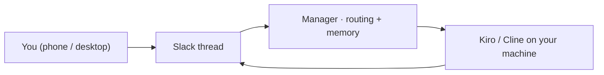

# cli-controller

**Text your coding agent. From anywhere.** Open a Slack thread, say what you want, and a local manager runs it through Kiro or Cline on your own machine. No SSH, no public URL, no server. Just your phone and a thread.



It runs over Slack's official **Socket Mode**, so the bot dials out over a WebSocket. Nothing listens on your machine, nothing is exposed, and no unofficial chat library can get your account banned (the full comparison lives in [`evaluation.md`](evaluation.md)).

---

## 60-second start

```bash
npm install -g cli-controller-lib
cli-controller                 # launches the setup wizard
```

The wizard finds your coding CLI, takes your two Slack tokens, validates them live, locks the allow-list to just you, and starts everything. Then you DM your bot. That is the whole install.

You need **Node 18+** and one coding CLI on your PATH:
- **Kiro** — `kiro-cli chat --list-models` should work
- **Cline** — `npm i -g cline`

---

## Get the two Slack tokens (about 5 minutes)

> **Work laptop where you can't add apps?** Spin up a free personal Slack workspace, build the app there, and add it to the Slack client you already have. No admin needed.

At **https://api.slack.com/apps → Create New App → From scratch**:

1. **Socket Mode** → turn it **on**. Generate an **App-Level Token** with `connections:write`. That is your **`xapp-`** token.
2. **OAuth & Permissions → Bot Token Scopes** → add: `chat:write`, `im:history`, `im:read`, `im:write`, `files:write`, and `reactions:write` (for the ⏳ / ✅ / ❌ status ticks).
3. **Event Subscriptions** → turn **on** → subscribe to `message.im`.
4. **App Home** → enable the **Messages Tab** and allow messages from it.
5. **Install to Workspace** → copy the **Bot User OAuth Token**. That is your **`xoxb-`** token.
6. Your member ID: profile → **⋮ → Copy member ID** (starts with `U`).

Paste both tokens and your member ID into the wizard when it asks. Done. (Driving it from channels too? See [`slack-bridge/SETUP.md`](slack-bridge/SETUP.md).)

Prefer manual config? Copy `slack-bridge/.env.example` to `slack-bridge/.env`, fill in `SLACK_BOT_TOKEN`, `SLACK_APP_TOKEN`, `SLACK_ALLOWED_USER_IDS`, and `KIRO_DEFAULT_CWD`. `.env` is gitignored.

---

## Living in it

**A thread is a session.** Your first message opens one. Every reply continues it. Different threads run in parallel, each with its own context.

**Plain text goes to the agent. `!` goes to the manager.**

```
Refactor the auth middleware and add tests.      ← the agent works
!model opus                                       ← manager, next turn uses opus
!abort                                            ← manager, stops now
```

| In a thread | |
|---|---|
| plain text | prompt the agent |
| `!abort` · `!status` | stop · session info (or elapsed time mid-run) |
| `!model <name>` · `!agent <name>` | set for the next turn |
| `!use <kiro\|cline>` · `!end` | switch brain · close the session |

| Anywhere | |
|---|---|
| plain top-level message | manager routes it and opens a session |
| `!new [dir=… model=…] <task>` | start explicitly, skip routing |
| `!recent [n]` · `!teleport <id>` | list sessions · pull one into this thread |
| `!recall <text>` | search past sessions from memory |

**It remembers.** Every turn is saved locally, searchable with `!recall` or the cockpit, across terminal and Slack sessions alike.

**Web cockpit** at `http://localhost:1234`: browse, search, start, and continue any session, and control the bridge.

---

## Cline

```bash
npm i -g cline && cli-controller doctor
```

Make it the default (`CLI_CONTROLLER_DEFAULT_BRAIN=cline`) or pick it per session:

```text
!new brain=cline dir=~/projects/api provider=anthropic model=claude-sonnet-4 fix the failing tests
```

`!provider` and `!model` apply to the next turn.

---

## How it runs the agent

By default the bridge drives Kiro **headless**: one `kiro-cli chat --no-interactive --resume-id` per turn, prompt on stdin, process exits when the turn ends. Continuity comes from the on-disk transcript, so idle threads hold no processes. An optional interactive **PTY** path (`node-pty`, `KIRO_PTY_RESUME=1`) rehydrates TUI/subagent sessions that headless resume can't (Kiro#9066). It stays off by default. Details and a decision diagram: [`plans/rupeshkashyap/cli-controller-npm-publish/pty-headless-modes.md`](plans/rupeshkashyap/cli-controller-npm-publish/pty-headless-modes.md).

---

## Security

This is remote code execution on your own machine, on purpose. The defaults keep it safe:

- Allow-list is **just you**. Never set `SLACK_ALLOWED_USER_IDS=*` on a shared workspace.
- Tool trust is opt-in. `KIRO_TRUST_TOOLS=fs_read` (read-only) is the default. `ALL` grants shell access, so keep it off a work box.
- The cockpit binds to `127.0.0.1`.
- Prompts and output travel through Slack. For work code, confirm your data policy first.

`cli-controller doctor` flags risky combinations. More in [`SECURITY.md`](SECURITY.md).

---

## Commands & internals

```bash
cli-controller start | stop | restart | status | doctor
cli-controller bridge <cmd>    # Slack bridge only
cli-controller panel  <cmd>    # web cockpit only
npm test                       # node:test — core, capture, libs, parsing
```

Layered: **Interfaces** (Slack, web) → **Manager** → **core** (runner, brains, memory) → **Brains** (Kiro, Cline). Architecture in [`plans/architecture/architecture.md`](plans/architecture/architecture.md). Adding a brain is one file: [`CONTRIBUTING.md`](CONTRIBUTING.md).

MIT, see [LICENSE](LICENSE).
