# arch_2_sequence — The Controller Needs a Memory

> Companion to `architecture.md`. That doc is the current-state truth (P0–P4). This doc is a **decision doc**: today's gap, the philosophy, and 3 concrete proposals for how the Controller (Layer 2) gets **ever-persistent memory** — across sessions, brains, and interfaces, forever.
>
> **Terminology:** the **Controller** is the interface/management agent (canonical name — see `architecture.md §1`). In this older doc it is also called the *Orchestrator* (its Layer-2 message-routing role); the *broker* (`broker.js`) is that role's implementation. All three refer to the same Controller side of the Controller↔CLIs split.

## 1. The gap, precisely

Today's Orchestrator (`broker.js`) is **stateless by design** — every call spawns a scratch Kiro session, gets a JSON decision, then **deletes that session immediately** (`chat --delete-session`). It has amnesia on purpose: it was only ever a *router*, not a *controller*.

That's wrong for the job you're describing. Verified against code:
```js
res = await runKiro({ cwd: BROKER_DIR, ... prompt: buildPrompt(userText, ctx) ... });
const sid = await getLatestSessionId(BROKER_DIR);
if (sid) spawn(KIRO_BIN, ['chat', '--delete-session', sid], ...);   // ← memory destroyed on purpose
```
It also **only fires on the first message of a thread** (`architecture.md` §1.5) — so even within a single conversation it never gets asked "resume or new?" because by the time you're mid-thread, the Orchestrator has already stepped out of the loop.

## 2. What you're actually asking for

Rephrased precisely, so we're aligned before proposing anything:

1. **The Orchestrator is a persistent entity, not a stateless function.** It has its own identity, its own memory store, and that memory is **never deleted** — it accumulates forever, the way a human PA's notebook does.
2. **The Orchestrator's memory ≠ any one coding session's memory.** Kiro session `X` remembers its own conversation. Cline session `Y` remembers its own. The Orchestrator remembers **across all of them**: which sessions exist, what they were about, which are stale, which repo/ticket/feature each touched — a superset, cross-referenced.
3. **The Orchestrator itself runs on a brain** (Kiro headless, or Cline headless, or whatever) — but the *brain choice for the Orchestrator* is orthogonal to *the brain choice for the coding task*. You could run the Orchestrator on Kiro while it delegates coding work to Cline, or vice versa.
4. **On ambiguity, it asks — it doesn't guess.** "Need to debug this or that" → the Orchestrator must recognize this could map to an existing open session *or* be a new task, and prompt: *"Resume the server debugging session from 2h ago, or start fresh?"* — using its memory to make that question well-informed (not a blind "new or resume?" every time).
5. **It must handle session-scale gracefully.** Long sessions, many sessions, many repos — the Orchestrator's memory needs retrieval (search/cross-reference), not just accumulation, or it drowns in its own history.
6. **The philosophical frame:** Slack/web is the **front desk of an agency**. You don't talk to "a coding tool" — you talk to **your controller**, who knows every worker (brain), every project (session/workspace), every open thread of work, and delegates or resumes with full context. That controller's memory is the product; the coding agents are replaceable staff.

## 3. Design constraints (carried over from `architecture.md` — non-negotiable)

- **Doctrine: personal-UX beats extensibility.** The memory system must make the *user's* life easier first. No enterprise-grade memory platform for its own sake.
- **No infra unless earned** (§ existing doctrine). File-based / embedded-DB first; only reach for a service if file-based genuinely can't do the job.
- **Native brain session files remain the source of truth for conversation content** (§6, architecture.md). The Orchestrator's memory is a **derived, cross-referencing index/journal** — it must never become the only copy of anything a brain already persists durably.
- **Brain-agnostic.** The Orchestrator's memory format cannot assume Kiro's `.jsonl` shape — it must work identically whether the underlying coding session came from Kiro, Cline, or a brain that doesn't exist yet.
- **Cross-platform, single-user, local-first** — same as everything else in this repo.

## 4. Prior art worth stealing from (not inventing this cold)

Your own environment already runs a working instance of exactly this pattern — **`claude-mem`** (documented in your memBrain `feature-claude-mem` skill): a lifecycle-hook-driven capture layer that writes **observations** per tool call into SQLite, with three-tier retrieval (search → timeline → full observation) and a **profile-scoped, append-only, cross-machine sync** model. That's not a hypothetical — it's running today for your Claude Code sessions.

The wider ecosystem (2026) converges on the same shape: **short-term** (live conversation, owned by the brain itself) + **mid-term** (structured facts/summaries, human-readable) + **long-term** (searchable index, often vector or FTS) — see OpenClaw's layered memory and Spring AI's `Session` (event-sourced short-term) + `AutoMemoryTools` (durable long-term) split. The universal principle: **a Memory Manager is the control point** — agents/brains never write directly into the store; a manager mediates writes (dedup, provenance, versioning) and reads (search, cross-reference). (This is the industry term for the pattern; in cli-controller our **Controller** plays this role.)

This cli-controller Controller plays that Memory-Manager role, scoped to *your* coding sessions instead of a general chat agent.

## 4.5 Build vs. buy — surveyed the open-source landscape (widened 2026-07-11)

First pass was too narrow (generic "agent memory" search surfaced mostly Python/chat-oriented projects, including `memento` — MIT and well-shaped, but only 13★/4 forks and its most recent commit is ~11 months old relative to today, which is a real maintenance-risk signal, not a nitpick). Widened the search specifically toward **coding-agent session memory / cross-CLI handoff** — our actual problem — and found a much stronger field:

| Project | License | Shape | Fit for us |
|---|---|---|---|
| **claude-mem** (thedotmack, 86.8k★) | Apache-2.0 | Lifecycle hooks + Bun worker + SQLite + Chroma vector DB + Python `uv` | **Doesn't fit as a dependency** (§ below) — full plugin lifecycle, needs Bun + Python, npm package alone is explicitly non-functional per their own docs. Data-model inspiration only. |
| **`akitaonrails/ai-memory`** (965★, 101 forks, MIT) | MIT | Single **Rust** binary, HTTP+MCP server, SQLite (FTS5 + optional `sqlite-vec`), git-versioned markdown wiki as source of truth, `/api/v1` read-only JSON frontend, loopback-only-by-default | **Best fit found.** Purpose-built for *exactly* our problem: cross-CLI-vendor handoff ("quit Claude Code mid-task, start Codex in the same directory, continue without re-explaining") across Claude Code, Codex, OpenCode, Cursor, Gemini CLI, OpenClaw, and more. 719 commits, **released today** (v1.11.2, Jul 11 2026) — genuinely active, not abandoned. Zero-LLM mode works out of the box (FTS5 search + rule-based summarization); LLM consolidation is opt-in. Server binds `127.0.0.1` with no auth by default — matches our exact security doctrine. Ships a real HTTP JSON API (`/api/v1/search`, `/recent`, `/overview`) we could call directly from `core/memory/` or even proxy through the web cockpit — no MCP round-trip required for our use. See §4.6 for the catch. |
| **`gora`** (mertdeveci5, 3★) | — | Python/Go, SQLite archive of Codex/Claude Code/Pi chat logs, `uv`-based CLI + TUI | Same category as ai-memory but far less mature (19 commits, no releases) and Python-native, not Node. Good validation that the "search across coding-agent histories" problem is real and recognized, not a fit itself. |
| **`agent-sessions`** (jazzyalex, 708★, MIT) | MIT | **Native Swift macOS app** (Xcode/SwiftUI), indexes Codex/Claude/OpenCode/Cursor/Hermes/OpenClaw histories, resume-command copy, live "Agent Cockpit" | Excellent proof that this exact idea (unified session browser + resume across coding CLIs) has real user demand and a mature, daily-updated project (1,713 commits) — but it's a **macOS-only GUI app, not an embeddable library**. Wrong shape for us (we need Node, cross-platform, headless). Worth studying its UX (Agent Cockpit, resume-command copy, quota meter) for our own web cockpit (`03-web-ui.md`), not its code. |
| **mem0** (Apache-2.0) | Apache-2.0 | Python-first; self-hosted needs Qdrant/Chroma+Ollama or Docker+Postgres+Neo4j | Doesn't fit — Python-native, every path pulls in a service. Violates "no infra unless earned." |
| memento, hermes-local-memory, hippo-memory, engram | mostly MIT | All Node/SQLite | Deprioritized after widening the search — none are purpose-built for coding-agent session handoff the way ai-memory is, and all are smaller/less proven. |

## 4.6 The catch with ai-memory — and the actual recommendation

`ai-memory` is the strongest match found, but it's **Rust, not Node**, and its default posture is a **standalone server process** (native binary or Docker) that our bridge/web-ui would talk to over HTTP — not an in-process library we `require()`. That's a real architectural difference from "zero new processes," though it's a much smaller violation of doctrine than claude-mem's Bun+Python+worker stack:

- It's a **single static binary**, no runtime dependencies (no Bun, no Python, no Docker required — Docker is one deployment option, not the only one). On macOS there's a native release binary; the maintainer explicitly notes it's the recommended path when you don't need Docker.
- It defaults to **loopback-only, no auth** — identical security posture to our own `web-ui` today. Running it as a long-lived local process is the same shape as `web-ui/server.js` itself, not a new category of thing.
- Its HTTP `/api/v1` surface (`/search`, `/recent`, `/overview`, per-project pages) is plain JSON — trivial to call from `core/memory/` with `fetch`, no MCP client needed for our purposes.
- Zero-LLM mode (FTS5 + rule-based summaries) satisfies our six requirements from §2 without needing any API key or model call for the memory layer itself — the Orchestrator's own brain call (Kiro/Cline) stays the only LLM in the loop if we want.

**Revised recommendation:** run `ai-memory` as a **second small local process** (same tier as the bridge and the web panel — we already run two; a third dedicated to memory is consistent, not a doctrine violation) and have `core/memory/` be a thin HTTP client against its `/api/v1` + `/hook` endpoints, rather than trying to force it in-process or building a hand-rolled SQLite+FTS engine ourselves. This is a *stronger* fit than the original memento-based plan: it's more actively developed, purpose-built for exactly our cross-brain-handoff problem, and ships the markdown-wiki + git-history audit trail your "ever-persistent, searchable, cross-referenced" requirement (§2) explicitly wants — for free.

**What we'd still write ourselves (small):** the `threads` linkage table (Slack/web thread → `ai-memory` session/project key) and the resume-vs-new-vs-ask decision logic (§6) — `ai-memory` gives us the *memory*, not the *decision policy*; that policy is inherently specific to this Orchestrator and isn't something any of these projects provide.

**Before committing in code:** verify (a) the native binary/Docker install works cleanly on Windows (its own docs mark native Windows "Experimental," WSL2 is the documented path — this is the one real cross-platform gap, worth a spike before P-whatever implements this), and (b) that running it as a background process fits acceptably into `bridge`/`panel`-style lifecycle scripts (start/stop/status) without adding meaningful setup burden for the end user — if it does add burden, the P0.5-style zero-LLM-FTS5-via-`better-sqlite3` fallback from the original plan remains the fallback, now demoted from "primary plan" to "fallback if ai-memory's Windows story doesn't hold up."

## 5. Three proposals

Each is internally consistent and shippable on its own. They differ in **where the Orchestrator's brain-and-memory actually lives** — that's the fundamental fork.

---

### Proposal A — "Orchestrator-as-a-Persistent-Brain-Session" (simplest, most literal)

**Idea:** The Orchestrator is *itself* one long-lived, never-deleted brain session (e.g. a Kiro session with `--resume-id` reused forever, or a Cline `--id`), living in a dedicated `~/.cli-controller/orchestrator/` workspace. Instead of spawning-and-deleting a scratch session per message (today's behavior), every routing call **resumes the same Orchestrator session**. Its own conversation history *is* its memory — no separate store.

```
User message ──► Orchestrator session (persistent, --resume-id=ORCH_SESSION forever)
                     reads its own history (native brain memory)
                     decides: resume session S, or start new
                     may also SEARCH: "list my recent decisions about server"
                        by grepping its own transcript
```

**Pros:** Zero new infrastructure — reuses exactly the resume mechanism `core/brain` already has. Memory is automatically as durable as the brain's own session store (already proven durable — §6 of architecture.md). Dead simple mental model: "the Orchestrator is a Kiro/Cline session that never ends."

**Cons:** The Orchestrator's context window fills up — a brain session's transcript isn't built for O(months) of routing decisions; it will need periodic compaction/summarization (context rot), and the brain has no native cross-referencing/search over *other* sessions' content (it only remembers its own conversation, not what Kiro-session-472 was about). Locks the Orchestrator's memory format to whatever the chosen brain's transcript format is — least brain-agnostic of the three.

**Where this shines:** if the Orchestrator's job stays roughly what it is today (routing + short-term "what did I decide 10 minutes ago") and you don't need deep cross-session search, this is the least code you'll ever write for it.

---

### Proposal B — "Controller-over-a-Memory-Store" (the claude-mem-inspired model — **recommended**)

**Idea:** Split the Orchestrator into two things that were conflated in Proposal A:
1. **The Orchestrator's reasoning** — still a headless brain call (Kiro/Cline/anything in the registry), but **stateless per call**, same as today.
2. **A separate, permanent Memory Store** — **`ai-memory`** running as a small local process (native binary or Docker, loopback-only, see §4.5–4.6) — that the Orchestrator **reads before deciding** (via its `/api/v1` HTTP endpoints) and **writes to after every decision** (via its `/hook` endpoint), regardless of which brain reasoned about it.

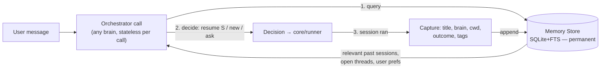

The Memory Store holds a **cross-referencing index**, not conversation content (respecting §6 — native files stay the source of truth). `ai-memory` already gives us sessions/handoffs/FTS5 search out of the box (each coding session becomes an `ai-memory` "project" page, auto-summarized at session end); we add two thin tables of our own in `core/memory/`'s local SQLite (separate from `ai-memory`'s own store — we don't touch its DB directly, only its HTTP API):
```
-- ours, in core/memory/ — small, local, just linkage + our own decision history:
decisions_log(ts, userText, decision{cwd,brain,agent,model,sessionId?}, outcome)
threads(interfaceThreadKey, sessionId, aiMemoryProjectKey, lastSeenAt)
-- "what sessions exist / what were they about" comes from ai-memory's
-- /api/v1/.../recent and /api/v1/search — we don't duplicate that store.
```
On each Orchestrator call: **query** `sessions_index`/`decisions_log` FTS for anything matching the user's text ("debug this or that" → finds 3 candidate open sessions from the last week) → feed those as *context* into the same NL-routing prompt used today → the brain now decides with real memory instead of guessing blind → if ambiguous, **return a clarifying question** instead of a decision (see §6 below for the exact UX). After the coding session runs, the Orchestrator **appends** a summary/outcome back into the store — this is the accumulation step that never happens today.

**Pros:** Brain-agnostic by construction — the store doesn't care if the coding session was Kiro or Cline, or if the *Orchestrator's own reasoning* used Kiro or Cline this time. Naturally scales — FTS5 (+ optional embeddings) means "cross-reference sessions" is a query against a genuinely active, purpose-built project (965★, released same day we wrote this — §4.5), not a research problem. Matches proven precedent (claude-mem's data model, and now validated independently by `ai-memory`, `gora`, and `agent-sessions` all converging on the same shape) without inheriting claude-mem's heavy runtime. `ai-memory`'s own scope (git-versioned wiki, session handoffs, cross-CLI support already built for Claude Code/Codex/OpenCode/Cursor/Gemini CLI) means when we eventually add a Claude-Code-based brain or similar to our own registry, `ai-memory` likely already understands its session format — free future-proofing. Cleanly separates "what did the user ask historically" (our `decisions_log`) from "what sessions exist and what were they about" (`ai-memory`'s own store, queried over HTTP) from "which thread maps to which session" (our `threads`) — each answerable independently.

**Cons:** `ai-memory` runs as a **separate local process**, not an in-process library — one more thing to start/stop/monitor alongside the bridge and web panel (mitigated: same tier as those two, and it's a single static binary — no Bun/Python/Docker *required*). Requires a capture step after every run (a hook into `core/runner.js`, POSTing to `ai-memory`'s `/hook`) — a new integration point that must be as failure-safe as the existing session-capture logic (§5 of architecture.md). **Windows support is "Experimental"** per `ai-memory`'s own docs (WSL2 is the documented primary path) — this is the one open risk item to spike before committing (§4.6).

**Why recommended:** it's the only proposal that cleanly satisfies *all six* of your stated requirements in §2 simultaneously — persistent forever (SQLite file, never deleted), brain-agnostic Orchestrator, resume-vs-new prompting *informed by real history*, and search/cross-reference as a first-class primitive rather than an afterthought. It's also the most extensible: adding a 4th brain, a 3rd interface, or a smarter ranking algorithm for "which past session matches this message" are all changes *within* the Memory Store or the query step — the Orchestrator's call contract never changes.

---

### Proposal C — "Federated Memory: One Journal Per Brain, Unified at Query Time" (most future-proof, most work)

**Idea:** Instead of one central store (Proposal B), each **Brain adapter** (`core/brain/kiro.js`, `core/brain/cline.js`, future ones) is responsible for exposing its *own* structured journal of what its sessions were about — piggybacking on `listSessions`/`recentSessions`, which already exist in the Brain contract (`architecture.md` §3). The Orchestrator doesn't own a store at all; it's a **read-only federator** that queries every registered brain's journal at decision time and merges results, plus a *thin* layer of its own for cross-brain facts a single brain's journal can't hold (e.g. "the user said this feature spans both the Kiro session in `api/` and the Cline session in `frontend/`").

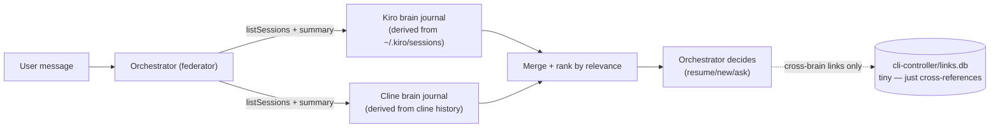

**Pros:** Maximum brain-agnosticism — each brain owns its own memory shape, which fits naturally with "adding a brain = one file" (the existing doctrine in `01-brain-multi-cli.md`). No large central store to keep in sync with reality; the Orchestrator's view is always freshly derived (no staleness risk between the store and the native files).

**Cons:** Every brain adapter now needs to implement a *summarization/journaling* capability (not just `listSessions`), which is real new work per brain — Kiro's `.jsonl` has no summary field today, so this proposal requires either (a) an LLM summarization pass per session (cost, latency) or (b) accepting a much thinner "title + timestamps only" federation with no real semantic cross-referencing, which undercuts the whole point. Cross-brain reasoning ("this spans two brains") has nowhere natural to live except the thin side-store, which starts to look like Proposal B's store anyway, just smaller and bolted on later. Query-time federation across N brains is slower than one indexed store, and gets worse as N grows — the opposite of what you want when session count is large (your own stated concern, §2.5).

**Where this shines:** if you expect to add many brains from many different vendors, each with genuinely different memory semantics, and you want the *core* to stay minimal even at the cost of the Orchestrator doing more work per query. Realistically the weakest fit for solo/personal use today — it optimizes for a multi-vendor future at the cost of the exact "super clean, flawless, ever-persistent" experience you asked for right now.

## 6. The interaction you specifically described ("debug this or that")

Regardless of which proposal, the **decision flow** the Orchestrator must run is the same — this is the actual behavior spec, independent of storage:

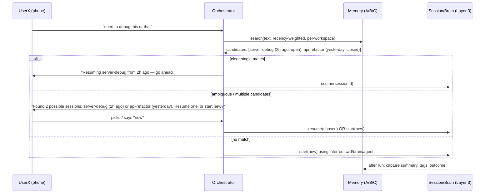

**This is the flawless behavior bar:** never silently guess when confidence is low, never ask when confidence is high (that's just friction), and **every outcome — resumed, new, or abandoned — feeds back into memory** so the next ambiguous message is *less* ambiguous over time. That feedback loop is the actual product; everything else is plumbing.

## 7. Recommendation

**Proposal B**, with `core/memory/` as a thin HTTP client against **`ai-memory`** (§4.5–4.6) plus our own two linkage tables, sitting alongside `core/brain/` and `core/runner.js` — same architectural tier, same doctrine (loopback-only, brain-agnostic, fails open, and now: **prefer a proven, actively-developed, purpose-built project over hand-rolled search or a stale dependency**). It is the only option that hits all six requirements in §2 without deferring hard parts to a later, unspecified phase — and per §4.5/§4.6, it's also the cheapest to build correctly, since the storage/search/summarization/handoff engine is a binary install away rather than a from-scratch project. Recommend sequencing it as its own phase (call it **P4.5** or fold into P5 before onboarding) since the NL-onboarding wizard (`04-onboarding.md`) already assumes a workspace registry that overlaps heavily with this store's schema — building the Memory Store first makes the onboarding wizard's "register my repos" step trivially just its first write. **Gate this on the Windows spike in §4.6 before writing code** — if native Windows support doesn't hold up, fall back to a minimal `better-sqlite3`+FTS5 module of our own (still satisfies all six §2 requirements; loses only the free session-handoff/wiki tooling).

## 8. Open questions before implementation (answer before coding, not during)

1. **Retention:** truly forever, or forever-with-compaction (old decisions summarized/pruned after N months)? "Ever persistent" and "doesn't grow unbounded and slow" are in tension once sessions number in the thousands.
2. **Cross-device:** is this memory single-machine (matches current doctrine) or does it need the same sync model as `claude-mem` (per-machine append-only + git sync) if you ever run cli-controller from two boxes?
3. **Confidence threshold:** what similarity/recency score triggers "just resume" vs "ask" vs "just start new"? Needs a first cut, then tuning from real use — not something to over-design up front.
4. **Who can see the memory:** the web cockpit will want a "Memory" or "Orchestrator log" view eventually (search decisions, not just sessions) — worth reserving a `/api/memory` shape now even if the UI ships later.
5. **Verify `ai-memory` on Windows before writing code against it (§4.6):** its own docs mark native Windows "Experimental" and recommend WSL2. Spike: does the native `.exe` work well enough standalone, or does requiring WSL2 add real friction for a Windows user of `cli-controller`? If WSL2 friction is unacceptable, fall back to a minimal `better-sqlite3`+FTS5 module we own directly (still satisfies §2's six requirements — we just lose the free wiki/handoff tooling and have to write our own summarization step).

---

## 9. Integrated architecture & request-flow stories (Proposal B realized)

How everything fits once `ai-memory` is wired in. `ai-memory` runs as a small local process (loopback); the Orchestrator **reads it before deciding** and the runner **writes to it after every turn**. Native brain stores stay the transcript source of truth; `ai-memory` is the cross-session index/journal.

### 9.1 The whole picture

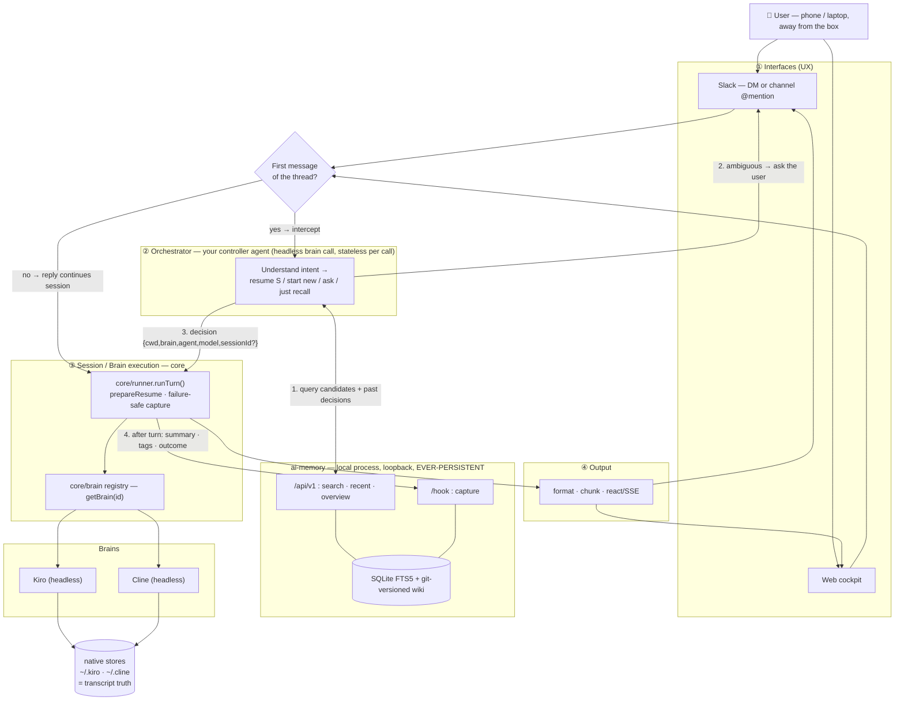

**The loop that makes it get smarter:** step 1 (read memory) + step 4 (write memory) close a feedback cycle — every resolved request makes the next ambiguous one easier to route. That loop is the actual product.

### 9.2 Story A — ambiguous ask ("need to debug this or that")
*Memory turns a vague sentence into an informed choice instead of a blind "new or resume?".*

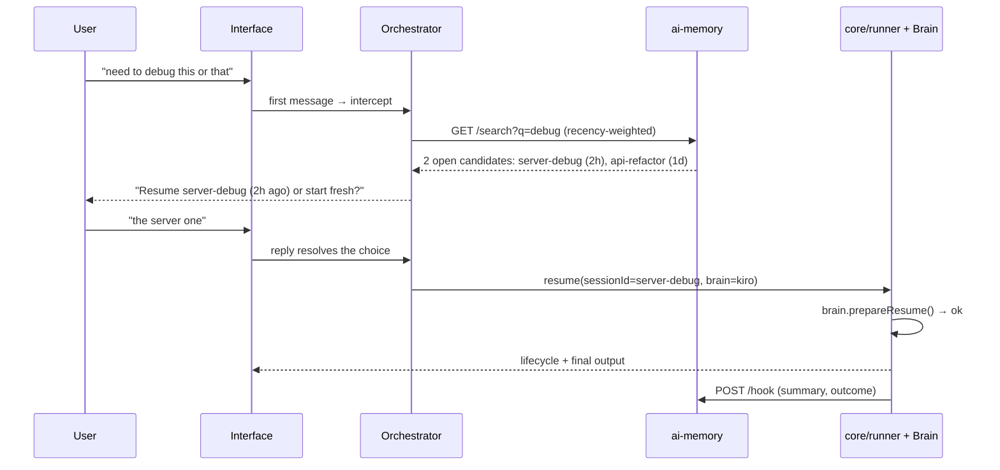

### 9.3 Story B — clear new task (no ambiguity, no friction)
*High confidence → no question asked. Memory still records the outcome.*

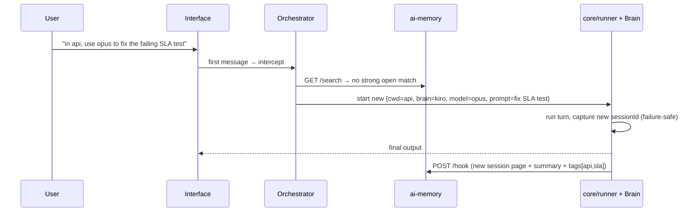

### 9.4 Story C — continue in an existing thread (Orchestrator skipped)
*Once a thread IS a session, replies bypass Layer 2 entirely — zero orchestration overhead.*

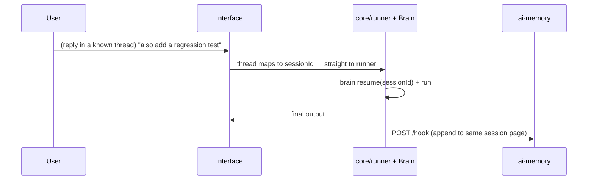

### 9.5 Story D — pure recall, no session started
*"Search my past work" is a first-class action — the controller answers from memory without spinning up a coding agent.*

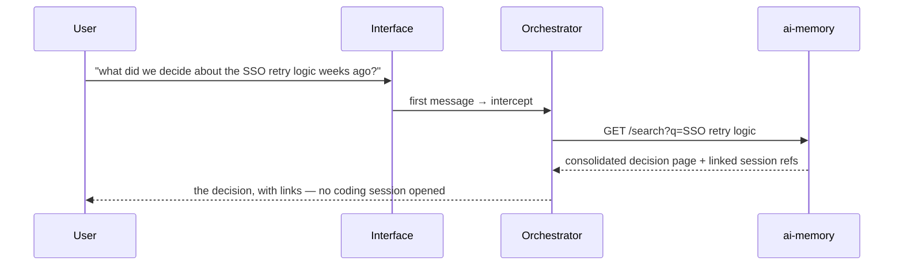

### 9.6 Story E — Kiro resume-lock (session live elsewhere)
*Per-brain quirk stays behind the adapter; the user just gets a safe choice.*

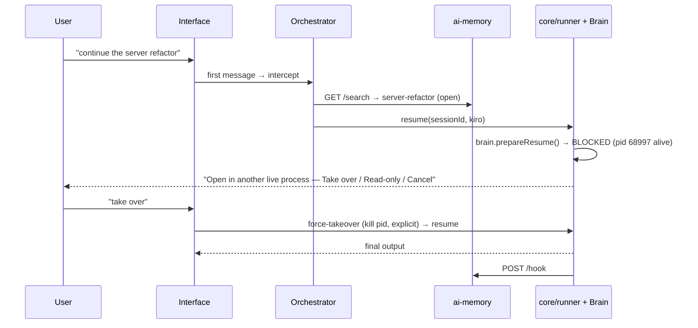

### 9.7 Story F — cross-brain handoff (the ai-memory superpower)
*Started on Kiro, continue on Cline without re-explaining — memory carries the context across vendors.*

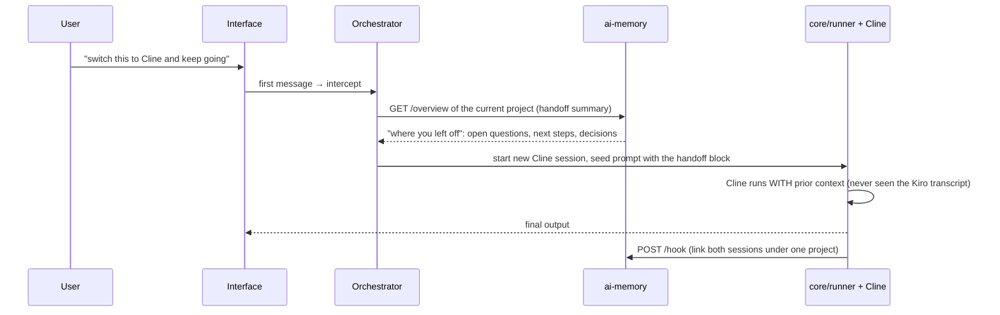

### 9.8 What is read vs written (one-glance contract)

| Moment | Direction | Endpoint | Payload |
|---|---|---|---|
| Before routing a first message | read | `GET /api/v1/.../search`, `/recent`, `/overview` | candidates, past decisions, handoff summary |
| Ambiguity resolved / decision made | write (ours) | `core/memory` `decisions_log` | userText → {cwd,brain,agent,model,sessionId?} |
| After every turn (any interface, any brain) | write | `POST /hook` | session summary, tags, outcome, files/commands |
| Thread ↔ session linkage | write (ours) | `core/memory` `threads` | interfaceThreadKey ↔ sessionId ↔ aiMemoryProjectKey |
| Web "Memory" view / recall | read | `GET /api/v1/search` | decisions + sessions, cross-referenced |

**Invariant:** the Orchestrator and web cockpit only ever touch `ai-memory` over HTTP and our own two small tables — never a brain's native store directly (that stays read-only truth, §6).

---

## 10. ai-memory enrichment pipeline (how raw turns become searchable memory)

Memory isn't "dump every message into a table." It's a **compile-not-retrieve** pipeline (Karpathy LLM-Wiki pattern, which `ai-memory` implements): raw events are captured, then *consolidated* into coherent pages at session boundaries, then indexed for retrieval. Enrichment happens in stages, mostly asynchronously — the user never waits on it.

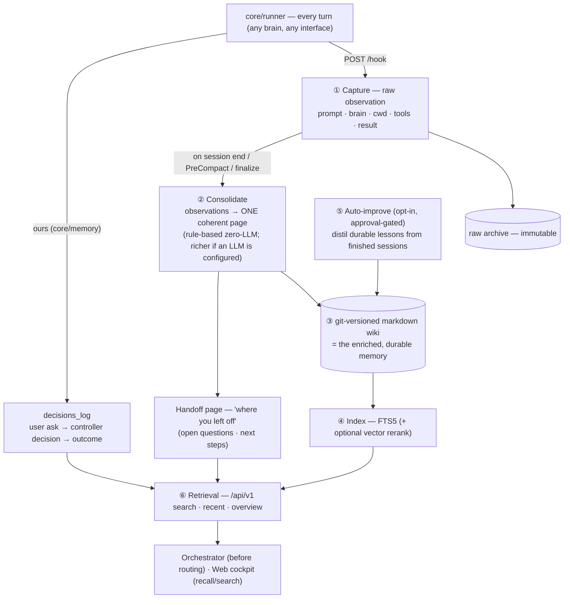

| Stage | What | When | Who |
|---|---|---|---|
| ① Capture | One observation per turn (+ a session-boundary marker). **We are the hook source** — our `core/runner` POSTs to `/hook` after each turn; we do NOT hook into each brain's internal lifecycle (cleaner, brain-agnostic). | every turn, fire-and-forget (fails open) | `core/runner` → `ai-memory /hook` |
| ② Consolidate | Compile the session's observations into a single narrative page + a handoff block. Zero-LLM = rule-based summary; with an LLM configured = richer prose. | at session end / compaction / manual finalize | `ai-memory` (async) |
| ③ Persist | Page written to a git-versioned markdown wiki — the "ever-persistent" store. Superseding edits are new commits (time-travel, never destructive). | on consolidate | `ai-memory` |
| ④ Index | FTS5 keyword index (+ optional embeddings for semantic rerank). | on write | `ai-memory` |
| ⑤ Auto-improve | Background pass over finished sessions distils durable, reusable lessons ("we standardised on X"); approval-gated so it can't silently pollute. Opt-in. | scheduled | `ai-memory` |
| ⑥ Retrieve | Consolidated *pages* (not raw logs) come back for a query — so the Orchestrator sees "the decision," not 400 chat lines. | before routing / on recall | Orchestrator, web |

**Two enrichment streams, kept separate:** `ai-memory` owns the *content* memory (what happened in sessions). Our tiny `decisions_log` owns the *routing* memory (what the user asked the controller → what it decided → whether that was right). The second is what lets the controller learn "when this user says 'debug', they usually mean the server session" — a controller-specific signal no generic memory tool provides.

**Doctrine note:** enrichment is opt-in-deep. Out of the box it's zero-LLM (FTS5 + rule-based summaries) — no API key, no latency tax on the user. LLM consolidation and auto-improve are switches you flip when you want richer recall, not prerequisites.

---

## 11. Control routing — who gets the message? (the `!`-to-controller model)

You spotted the real hole: "first message = controller, everything else = agent" **breaks the moment the controller asks a clarifying question**, because the user's *next* message could be (a) an answer to the controller, or (b) a task for the agent. And more broadly — a user should be able to summon the controller **any time**, even deep inside a live agent thread. Your `!`-prefix instinct is the right answer. Here's the formalized model.

### 11.1 Where the clarifying reply goes: **into the thread** (not DM)

The thread is the conversational unit. Splitting a conversation across a DM and a thread is confusing, and in a channel it would either leak into the channel or fragment context. So `"Resume server-debug or start fresh?"` posts **in the thread**. Disambiguation is handled by **thread state**, not by which surface the message lands on.

### 11.2 A thread has a state; routing follows the state

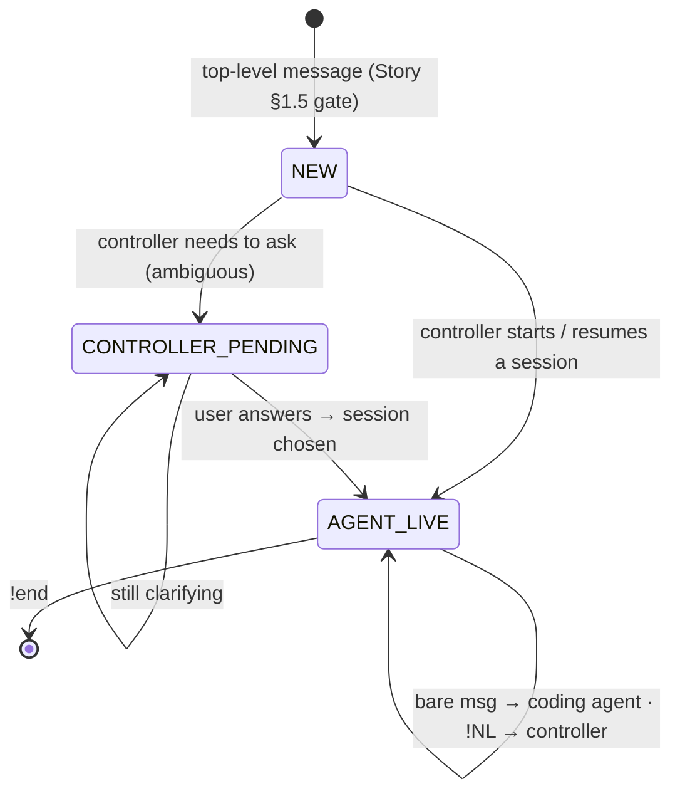

- **CONTROLLER_PENDING** — the controller asked something and no session exists yet. There is **no competing consumer**, so the next bare message is unambiguously the answer. (This is the clean resolution to your question: during clarification the thread is controller-owned by construction.)
- **AGENT_LIVE** — a session exists. Now the split matters, and `!` is the switch.

### 11.3 The `!` rule: bare = agent, `!` = controller (in natural language)

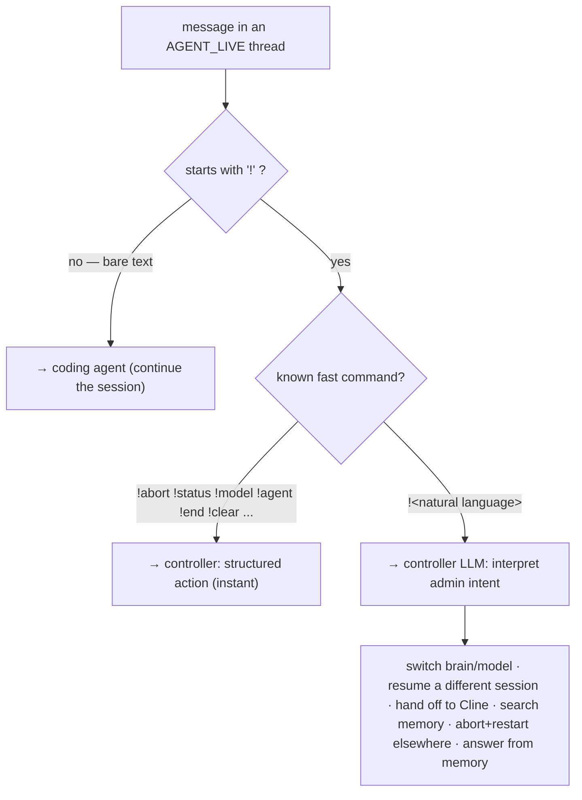

**Verdict: yes, adopt this — it's the right model, and it's a clean generalization of what already exists.** Today `!abort`, `!model`, etc. are structured controller commands. Your proposal simply says: **`!` means "address the controller," and anything after it that isn't a known command is natural language the controller interprets.** So:
- `!abort` → instant structured action (fast path, no LLM).
- `!switch this to cline and keep going` → controller LLM interprets → cross-brain handoff (§9.7).
- `!what did we decide about the retry logic` → controller answers from memory (§9.5), agent untouched.
- `!this is wrong, start over in api with opus` → controller aborts the run, opens a new session.

Why this is the right call:
- **Frictionless default preserved.** Bare typing still just talks to your agent — the 95% case pays nothing.
- **One memorable escape hatch.** `!` = "I want the controller," in plain language, from anywhere — including mid-run for control ops (abort/status/switch work concurrently with a running turn; a bare message during a run stays single-flight → "still working, use `!abort`").
- **Backward compatible.** Existing `!commands` are just the fast-path subset of `!<controller intent>`.
- **The controller has authority over the thread's session binding** — it can abort, re-point the thread to a different session, swap the brain, or hand off — which is exactly "snatch control anytime."

### 11.4 One refinement worth adding
For the clarifying question specifically, prefer an **explicit affordance** over free text where the interface allows it — Slack interactive buttons (`[Resume server-debug] [Start fresh]`) or a numbered reply (`1` / `2` / `new`). The state machine makes free-text answers work regardless, but buttons make it thumb-friendly on a phone and remove the last sliver of ambiguity. Treat buttons as an enhancement on top of the state machine, not a replacement for it.

### 11.5 Net rule (the whole thing in one line)
> **Thread state decides by default; `!` overrides to the controller.** New/clarifying thread → controller. Live agent thread → bare text goes to the agent, `!<anything>` summons the controller (fast command if recognized, else natural-language admin). The controller can seize the thread's session binding at any time.

This also means the §9 stories get one addition: after Story A's question, the thread sits in **CONTROLLER_PENDING**, so "the server one" routes to the controller as the answer — and from then on, `!` is how the user reaches the controller again without disturbing the agent.
