# cli-controller Architecture Review

> Work item: `architecture`  
> Location: `plans/architecture/architecture.md`  
> Repository reviewed: `cli-controller`  
> Review focus: how the current system works, what boundaries exist, where state lives, what flows through the system, and what risks matter before future changes.

---

## 1. Executive summary

`cli-controller` is a local automation controller for running Kiro CLI coding sessions from Slack, with an optional local web dashboard.

The system has two main apps:

| Area | Folder | Runtime | Responsibility |
|---|---|---|---|
| Slack bridge | `slack-bridge/` | Node.js + `@slack/bolt` Socket Mode | Receives Slack messages, maps each Slack thread to a Kiro session, spawns `kiro-cli`, sends results back to Slack. |
| Web dashboard | `web-ui/` | Node.js + Express + static HTML | Shows local Kiro sessions, bridge status/logs/threads, and provides bridge start/stop/restart controls. |

The most important design idea:

> **The bridge does not store full conversations. It stores pointers from Slack threads to Kiro session IDs. Kiro owns the real conversation history on disk.**

In plain language:

1. A Slack user sends a top-level message.
2. The bridge creates or routes a new Slack thread.
3. That thread gets a persisted record in `slack-bridge/state.json`.
4. For every user message, the bridge launches a fresh `kiro-cli` process.
5. Kiro loads/persists conversation memory from its own session files under the user's home directory.
6. The bridge formats the final output and posts it back into the Slack thread.
7. The web dashboard reads the same local files to show a unified view.

---

## 2. System context

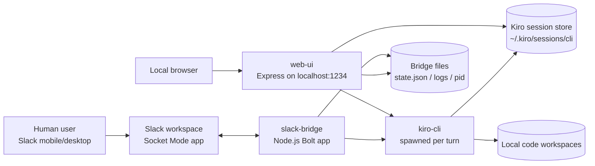

### What is local vs external?

| Thing | Location | Notes |
|---|---|---|
| Slack workspace/app | External SaaS | Used for chat UI and Socket Mode WebSocket. |
| `slack-bridge` | Local machine | Long-running Node process. Requires `.env` Slack tokens. |
| `web-ui` | Local machine | Local-only Express server bound to `127.0.0.1`. |
| `kiro-cli` | Local machine | Spawned by bridge and queried by dashboard. |
| Kiro session files | Local machine | Stored under `~/.kiro/sessions/cli`. |
| Target code repositories | Local machine | Kiro runs inside configured working directories. |

---

## 3. Repository layout

```text
cli-controller/
  README.md
  evaluation.md
  approaches.md
  free-safe-recommendation.md
  slack-and-kiro-bridge.md
  web-ui-spec.md
  work-laptop-options.md

  slack-bridge/
    package.json
    package-lock.json
    .env.example
    .env                  # local secret config; gitignored
    bridge                # bash lifecycle helper
    run.sh
    bridge.log            # runtime log; gitignored
    bridge.err.log        # runtime stderr log; gitignored/local
    bridge.pid            # runtime pid file; gitignored
    state.json            # Slack-thread -> Kiro-session pointer store; gitignored when created
    src/
      index.js            # main Slack app and command/message orchestration
      kiro.js             # child-process wrapper around kiro-cli
      broker.js           # natural-language router using a fast Kiro call
      sessions.js         # state.json persistence helper
      chunk.js            # Slack-safe chunking helper
      format.js           # Markdown/Slack formatting and Kiro tool-trace stripping

  web-ui/
    package.json
    package-lock.json
    server.js             # Express API + static server
    panel                 # bash lifecycle helper
    panel.log             # runtime log; gitignored
    panel.pid             # runtime pid file; gitignored
    public/
      index.html          # entire dashboard UI, CSS, and frontend JS inline

  plans/
    architecture/
      architecture.md     # this review
```

### Work-item planning convention going forward

For future work, use this shape:

```text
plans/
  <work-item-name>/
    README.md or <work-item-name>.md
    raw-notes.md
    diagrams.md
    decisions.md
    test-notes.md
```

For this review:

```text
plans/
  architecture/
    architecture.md
```

---

## 4. Runtime containers/components

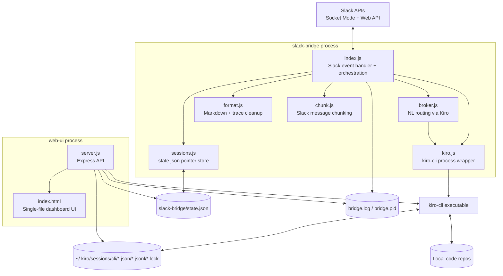

---

## 5. Component responsibilities

### 5.1 `slack-bridge/src/index.js`

This is the main brain of the Slack side.

Responsibilities:

- Loads `.env` via `dotenv`.
- Creates the Slack Bolt app in Socket Mode.
- Enforces Slack user allow-list.
- Parses top-level messages vs thread replies.
- Implements Slack commands:
  - `!help`
  - `!new`
  - quick aliases like `!25-opus`
  - `!recent`
  - `!teleport <sessionId>`
  - `!agents`
  - `!models`
  - in-thread commands: `!peek`, `!status`, `!abort`, `!model`, `!agent`, `!verbose`, `!clear`, `!end`
- Maintains in-memory maps for currently running turns:
  - `running`: thread key -> child process
  - `progress`: thread key -> partial live output buffer
  - `aborted`: thread keys intentionally aborted
- Calls `runKiro()` for each actual Kiro turn.
- Captures newly-created Kiro session IDs after fresh sessions.
- Converts Kiro output into Slack-friendly output.
- Uses reactions to show status: working, done, error.

Key concept:

```text
Slack thread key = "<channel>:<root timestamp>"
```

That key maps to a Kiro session pointer in `state.json`.

---

### 5.2 `slack-bridge/src/sessions.js`

Small persistence layer.

It stores bridge state in:

```text
slack-bridge/state.json
```

Shape is effectively:

```json
{
  "C123456:1700000000.000000": {
    "cwd": "C:\\path\\to\\repo",
    "sessionId": "kiro-session-id",
    "agent": "main",
    "model": "claude-sonnet-5",
    "verbose": true,
    "announced": true
  }
}
```

Important:

- This is **not** full conversation memory.
- It is a pointer/index from Slack thread to Kiro session.
- It survives bridge restarts because it is on disk.

---

### 5.3 `slack-bridge/src/kiro.js`

Thin wrapper around `kiro-cli`.

Responsibilities:

- Builds safe process arguments as an array, not a shell string.
- Spawns:

```bash
kiro-cli chat --no-interactive [--resume-id <id>] [--agent <agent>] [--model <model>] --trust-tools=<tools>
```

or:

```bash
kiro-cli chat --no-interactive --trust-all-tools
```

when `KIRO_TRUST_TOOLS=ALL`.

- Sends the prompt via stdin.
- Captures stdout/stderr.
- Strips ANSI spinner/control output.
- Supports timeout killing.
- Provides helpers for:
  - listing sessions
  - listing agents
  - listing models
  - reading recent Kiro session metadata
  - checking Kiro session locks

Important architecture choice:

> Every Slack turn uses a fresh `kiro-cli` process. Continuity comes from `--resume-id`, not from keeping a Kiro process alive.

---

### 5.4 `slack-bridge/src/broker.js`

Natural-language router.

When a top-level Slack message is plain English, the bridge can ask Kiro to decide:

- Which directory to run in.
- Which agent to use.
- Which model to use.
- Whether the message contains an immediate task or just opens a session.

It does this by spawning Kiro in a temporary broker directory:

```text
os.tmpdir()/kiro-broker
```

The broker asks Kiro to return a minified JSON object:

```json
{
  "cwd": "absolute path",
  "agent": "main",
  "model": "claude-opus-4.8",
  "prompt": "actual task",
  "note": "short explanation"
}
```

If the broker fails, normal default-session flow is used.

---

### 5.5 `slack-bridge/src/format.js`

Output cleaning/formatting layer.

Responsibilities:

- Convert Markdown to Slack mrkdwn using `slackify-markdown`.
- Strip Kiro tool trace in quiet mode.
- Avoid swallowing the final assistant answer when stripping tool output.

This is the boundary between raw Kiro output and Slack human-readable output.

---

### 5.6 `slack-bridge/src/chunk.js`

Slack message-size helper.

Responsibilities:

- Split long output into Slack-safe chunks.
- Prefer line boundaries.
- Prefix multi-part responses as `(1/N)`, `(2/N)`, etc.

The bridge can also upload very long output as a Slack file snippet depending on `KIRO_SNIPPET_THRESHOLD`.

---

### 5.7 `web-ui/server.js`

Local Express API and static file server.

Responsibilities:

- Binds to:

```text
127.0.0.1:<PANEL_PORT or 1234>
```

- Serves `web-ui/public/index.html`.
- Reads Kiro sessions from:

```text
~/.kiro/sessions/cli
```

- Reads bridge state from:

```text
slack-bridge/state.json
```

- Reads bridge logs from:

```text
slack-bridge/bridge.log
```

- Provides bridge controls by shelling out to:

```bash
bash slack-bridge/bridge start|stop|restart
```

- Provides API endpoints:

| Endpoint | Purpose |
|---|---|
| `GET /api/status` | Bridge status, Slack thread count, Kiro session count. |
| `POST /api/bridge/start` | Start bridge via helper script. |
| `POST /api/bridge/stop` | Stop bridge via helper script. |
| `POST /api/bridge/restart` | Restart bridge via helper script. |
| `GET /api/bridge/logs` | Tail bridge logs, with token redaction. |
| `GET /api/bridge/threads` | Show Slack-thread pointers from `state.json`. |
| `GET /api/sessions` | List Kiro sessions with filtering/sorting. |
| `GET /api/sessions/:id` | Detail for one Kiro session. |
| `GET /api/agents` | Run `kiro-cli agent list`. |

---

### 5.8 `web-ui/public/index.html`

Single-file dashboard.

Contains:

- HTML structure.
- CSS styling.
- Inline frontend JavaScript.

Frontend views:

- Dashboard summary.
- Sessions list.
- Session detail.
- Bridge status/logs/threads.

No frontend build step exists.

---

## 6. Slack-to-Kiro message lifecycle

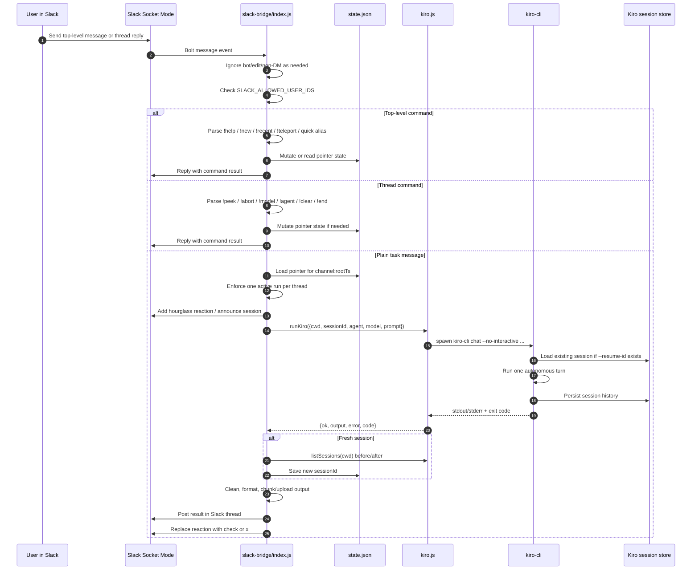

---

## 7. Top-level message routing logic

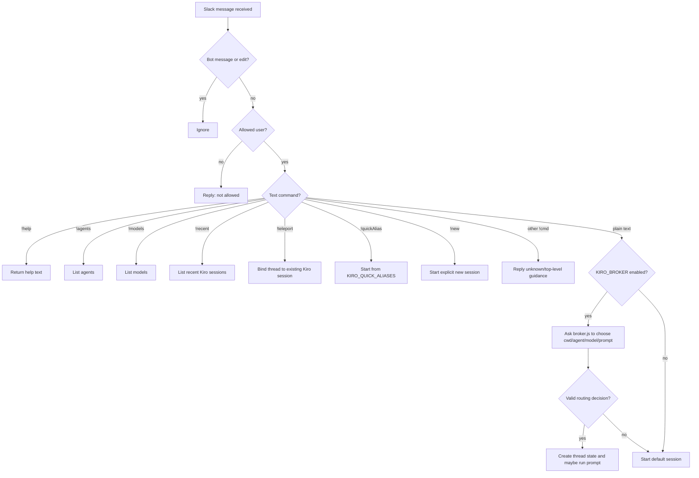

---

## 8. Thread reply logic

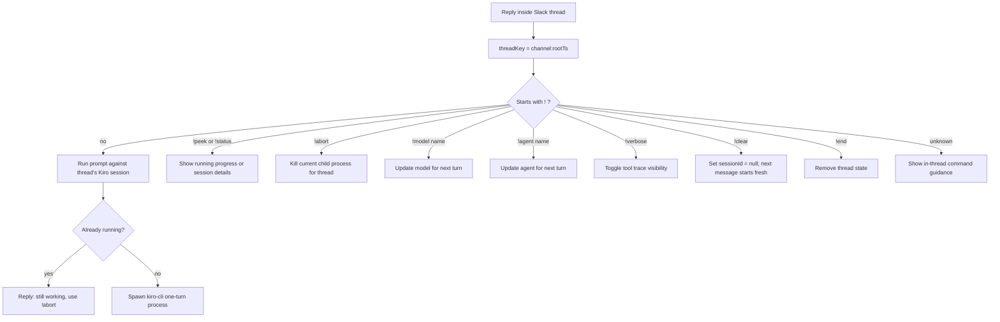

---

## 9. State model

The architecture has three different state layers. This is critical.

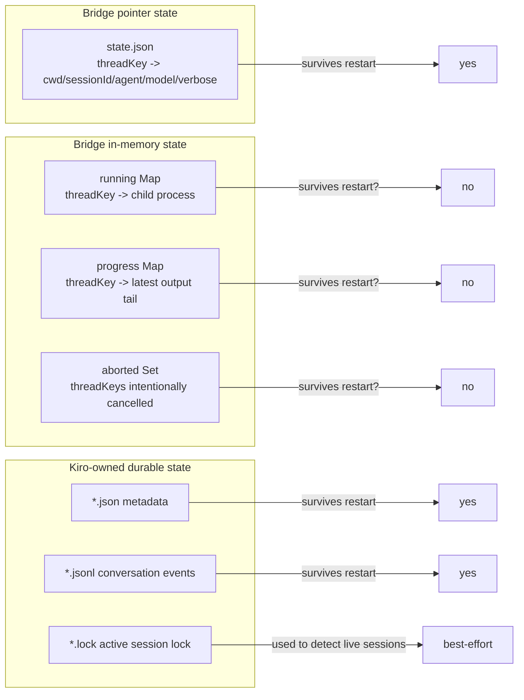

### State layer table

| Layer | File/location | Owned by | Contains | Survives restart? |
|---|---|---|---|---|
| Bridge pointer | `slack-bridge/state.json` | `sessions.js` | Slack thread -> Kiro session pointer and preferences. | Yes |
| In-flight process map | JS memory in `index.js` | `index.js` | Running child processes and partial progress. | No |
| Kiro metadata | `~/.kiro/sessions/cli/*.json` | Kiro CLI | Session title, cwd, timestamps, model/agent metadata. | Yes |
| Kiro transcript/events | `~/.kiro/sessions/cli/*.jsonl` | Kiro CLI | Conversation history/events. | Yes |
| Kiro locks | `~/.kiro/sessions/cli/*.lock` | Kiro CLI | Active process lock information. | Temporary |
| Runtime logs | `bridge.log`, `panel.log` | shell/process redirects | Process output. | Yes until deleted/rotated |
| Runtime PIDs | `bridge.pid`, `panel.pid` | helper scripts/manual startup | Process IDs. | Yes, but can become stale |

---

## 10. Web dashboard architecture

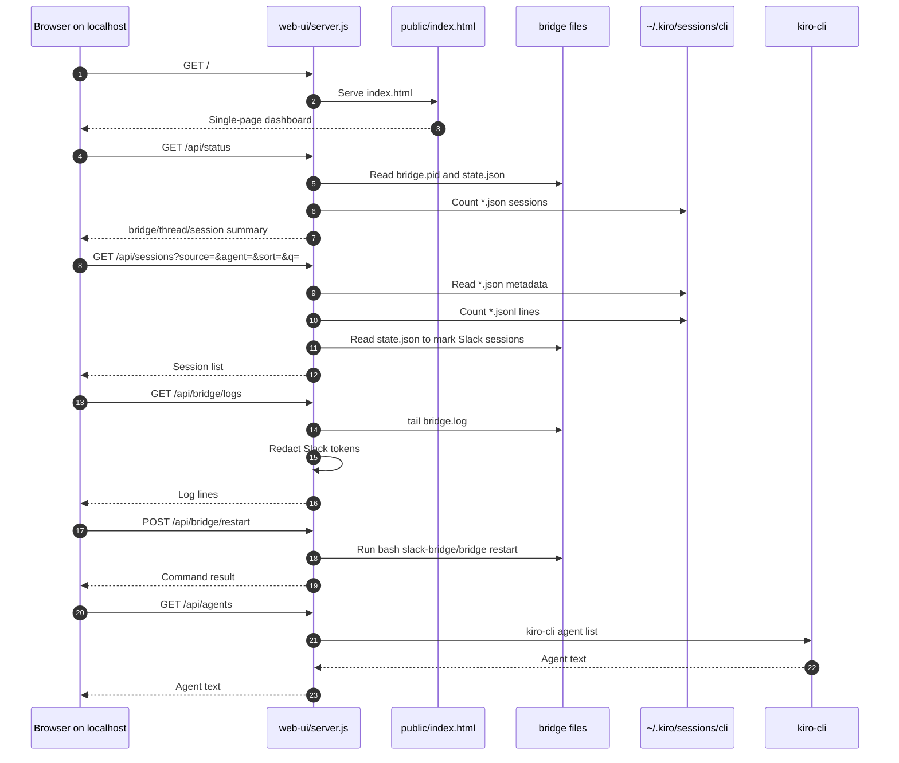

---

## 11. Data flow: from Slack text to code changes

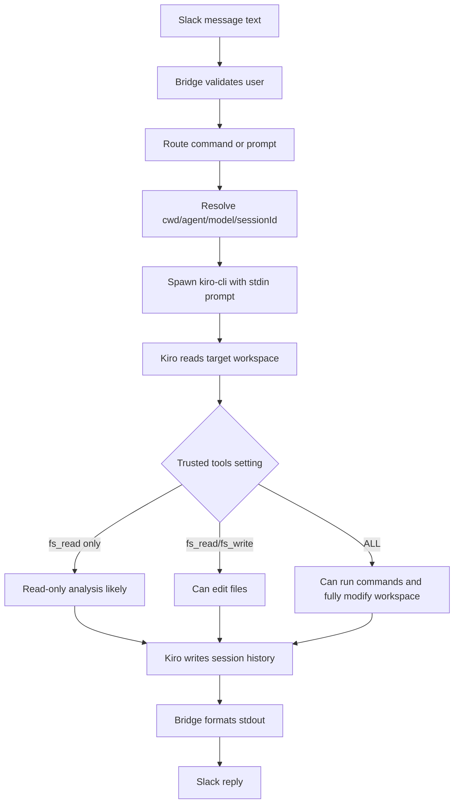

### Trust boundary warning

`KIRO_TRUST_TOOLS=ALL` means the Slack bridge can trigger a Kiro run that may modify files and execute commands on the local machine. This is the largest security boundary in the whole system.

---

## 12. Configuration model

Configuration comes mostly from:

```text
slack-bridge/.env
```

Important variables:

| Variable | Used by | Meaning |
|---|---|---|
| `SLACK_BOT_TOKEN` | Slack Bolt app | Bot OAuth token. Secret. |
| `SLACK_APP_TOKEN` | Slack Bolt app | Socket Mode app token. Secret. |
| `SLACK_ALLOWED_USER_IDS` | `index.js` | Access control. `*`/`ALL` permits everyone in workspace. |
| `KIRO_BIN` | `kiro.js`, `broker.js` | Kiro executable path/name. Defaults to `kiro-cli`. |
| `KIRO_DEFAULT_CWD` | `index.js`, `sessions.js` | Default workspace. |
| `KIRO_AGENT` | `index.js`, `sessions.js` | Default Kiro agent. |
| `KIRO_MODEL` | `index.js`, `sessions.js` | Default model. |
| `KIRO_TRUST_TOOLS` | `index.js`, `kiro.js` | Tool permissions. `ALL` maps to `--trust-all-tools`. |
| `KIRO_DIR_ALIASES` | `index.js`, `broker.js` | Named workspace shortcuts. |
| `KIRO_QUICK_ALIASES` | `index.js`, `broker.js` | One-shot `!alias` presets. |
| `KIRO_BROKER` | `index.js` | Turns natural-language routing on/off. |
| `KIRO_BROKER_MODEL` | `index.js`, `broker.js` | Fast model used for routing. |
| `KIRO_TIMEOUT_MS` | `index.js`, `kiro.js` | Per-turn timeout. `0` means no timeout. |
| `KIRO_SNIPPET_THRESHOLD` | `index.js` | Slack file upload threshold for long output. |
| `PANEL_PORT` | `web-ui/server.js` | Dashboard port. Defaults to `1234`. |

---

## 13. Process lifecycle

### Intended Unix-like lifecycle

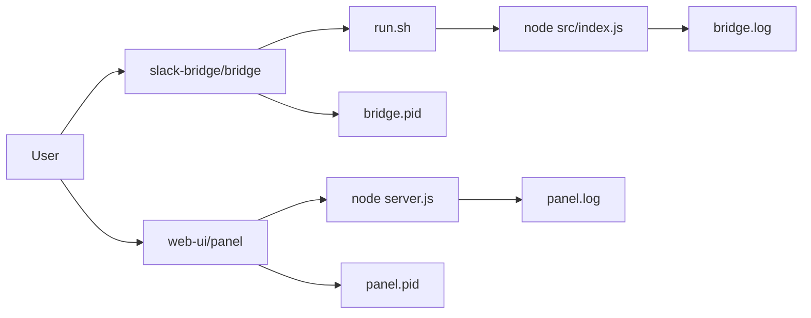

### Current Windows reality observed during setup

- Bash exists on this machine, but the helper scripts are Unix-oriented.
- Direct Node startup works well on Windows:

```powershell
node src/index.js      # from slack-bridge/
node server.js         # from web-ui/
```

- `web-ui/server.js` checks bridge status with:

```bash
kill -0 <pid>
```

That can report incorrect status on Windows even when the bridge Node process is running.

---

## 14. Error handling and resilience

### What is resilient today

| Area | Current behavior |
|---|---|
| Bridge restart | Slack-thread pointers survive in `state.json`; Kiro session memory survives in Kiro files. |
| Kiro process per turn | A hung/failing turn does not poison a long-lived Kiro process because there is no long-lived Kiro process. |
| One active run per thread | Prevents two concurrent Kiro turns from corrupting the same thread/session flow. |
| Broker failure | Falls back to default session behavior. |
| Long Slack output | Chunks or uploads as a file snippet. |
| Formatting failure | Falls back to raw text where possible. |
| Session list failures in dashboard | Usually returns empty data or best-effort results instead of crashing. |

### Fragile areas

| Area | Why it matters |
|---|---|
| Windows process status | `kill -0` and bash scripts are Unix-style; dashboard may show bridge offline incorrectly. |
| `execSync` with shell strings in dashboard | Several dashboard commands shell out through strings. This is acceptable for localhost/single-user but is weaker than spawn args. |
| `KIRO_TRUST_TOOLS=ALL` | Slack becomes a remote-control surface for arbitrary local actions through Kiro. |
| `SLACK_ALLOWED_USER_IDS=*` | Every user in the workspace can control the machine. |
| No dashboard authentication | OK for localhost; risky if port is exposed/tunneled. |
| State file has no schema/version | Future migrations could be brittle. |
| No structured logs | Logs are readable, but not machine-queryable. |
| No tests | Behavior relies on manual verification. |
| Web UI is a single large HTML file | Fast/simple, but hard to maintain as features grow. |
| Bridge and dashboard duplicate Kiro assumptions | Both know Kiro session paths and CLI commands separately. |

---

## 15. Security review

### Main security boundary

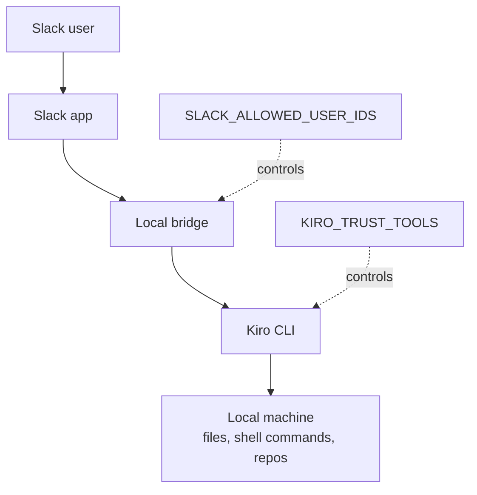

If both of these are broad:

```text
SLACK_ALLOWED_USER_IDS=*
KIRO_TRUST_TOOLS=ALL
```

then the effective access model is:

> Any user in the Slack workspace can trigger a local autonomous coding agent with full tool trust on this machine.

### Security recommendations

1. Restrict `SLACK_ALLOWED_USER_IDS` to specific Slack user IDs.
2. Avoid `KIRO_TRUST_TOOLS=ALL` unless this is a private/sandbox machine.
3. Keep dashboard bound to `127.0.0.1` only.
4. Do not tunnel the dashboard without adding auth.
5. Redact tokens in all logs and architecture docs.
6. Keep `.env`, `.env.backup-*`, logs, pid files, and state files out of Git.
7. Consider a startup warning/fail-safe when allow-all + trust-all are both enabled.

---

## 16. Architecture strengths

1. **Very simple runtime model**  
   No database, no queues, no build step, no hosted backend.

2. **Good restart story**  
   Bridge state is a small durable pointer file; Kiro owns real memory.

3. **Clean conversation mapping**  
   Slack thread = Kiro session is easy to understand.

4. **Parallelism is naturally scoped**  
   Separate Slack threads can run independently.

5. **Socket Mode avoids inbound networking**  
   No public webhook URL or port forwarding needed.

6. **Dashboard reuses existing local truth**  
   It reads Kiro files and bridge files directly instead of introducing another store.

7. **No shell injection in Kiro wrapper**  
   `kiro.js` uses `spawn` with argument arrays for Kiro turns.

---

## 17. Architecture risks and recommended improvement backlog

### Priority 1 — Safety and platform correctness

| Item | Recommendation | Why |
|---|---|---|
| Windows status check | Replace `kill -0` with cross-platform process detection. | Dashboard currently misreports bridge status on Windows. |
| Lifecycle scripts | Add Windows-native `.ps1` scripts or implement lifecycle in Node. | Current `bridge`/`panel` scripts are Bash-oriented. |
| Access-control warning | Fail or require explicit override for `SLACK_ALLOWED_USER_IDS=*` + `KIRO_TRUST_TOOLS=ALL`. | Prevent accidental full remote control exposure. |
| Path validation | Validate `KIRO_DEFAULT_CWD` and aliases at startup. | Avoid routing jobs into nonexistent directories. |

### Priority 2 — Maintainability

| Item | Recommendation | Why |
|---|---|---|
| Split dashboard frontend | Move inline JS/CSS from `index.html` into `app.js` and `style.css`. | Easier to maintain and review. |
| Shared Kiro config module | Create a shared config/paths module used by bridge and dashboard. | Reduces duplicated Kiro assumptions. |
| Structured logs | Log JSON lines or consistent prefixes. | Easier debugging and dashboard filtering. |
| State schema/version | Add versioned state file shape. | Safer future migrations. |

### Priority 3 — Testability

| Item | Recommendation | Why |
|---|---|---|
| Unit tests for parsing | Test `parseNew`, aliases, command routing, formatting. | These are high-value behavior surfaces. |
| Mocked Kiro tests | Mock `kiro-cli` child process behavior. | Enables reliable bridge flow tests. |
| Dashboard API tests | Test Express endpoints against fixture session files. | Prevents regressions in session display. |
| Smoke script | Add `npm run smoke` to verify config, Kiro binary, dirs, port, Slack env presence. | Faster local setup validation. |

---

## 18. Suggested future target architecture

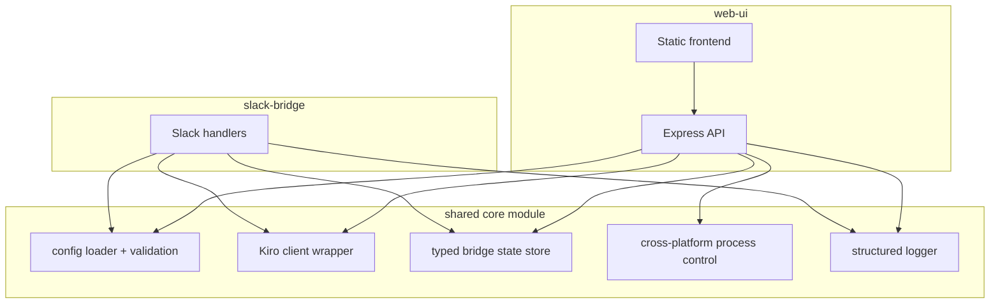

The target is not to over-engineer; it is to pull duplicated hard things into shared, tested modules:

- Config loading and validation.
- Kiro process execution.
- Bridge state handling.
- Cross-platform process status/control.
- Logging/redaction.

---

## 19. High-clarity mental model

If you remember only one thing, remember this:

```text
Slack thread
  ↓ maps through state.json to
Kiro session ID
  ↓ used by kiro-cli --resume-id to load
Kiro conversation history on disk
  ↓ runs one turn inside
Local workspace
  ↓ returns output to
Slack thread
```

Or as a diagram:

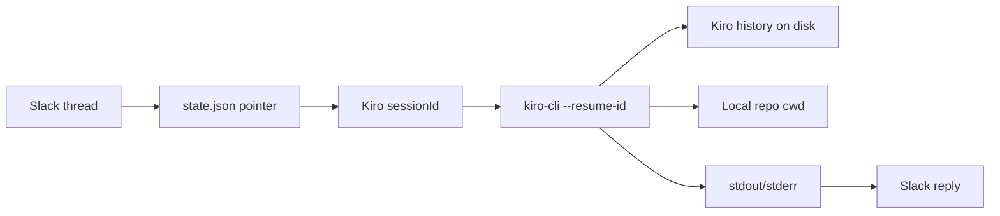

---

## 20. Open questions for future work

1. Should the bridge support multiple authenticated Slack users safely, or is single-user the intended permanent model?
2. Should `web-ui` eventually edit config, or remain read/control-only?
3. Should dashboard bridge control be cross-platform Node logic instead of Bash scripts?
4. Should `state.json` move to a safer location outside the repo folder?
5. Should Kiro session browsing include deletion/archival, or stay read-only?
6. Should long Kiro runs stream progress into Slack, or is final-output-only intentional?
7. Should natural-language routing be trusted by default, or should explicit aliases be preferred for safety?

---

## 21. Current local setup notes from architecture review

Observed during local setup/review on Windows:

- Repository cloned to `C:\Users\rupes\Desktop\work\cli-controller`.
- Dashboard runs on `http://127.0.0.1:1234`.
- Bridge can run via direct Node process.
- Kiro binary resolved to a local installed `kiro-cli` executable.
- Original pasted `.env` used macOS-style paths; local non-secret path settings were adjusted for Windows.
- Dashboard may show bridge offline even while the bridge process is alive because of Unix-style `kill -0` status checking.

---

## 22. Final review summary

`cli-controller` is a pragmatic, lightweight local control plane for Kiro. Its architecture is intentionally file-based and process-based:

- Slack is the remote UI.
- Socket Mode is the transport.
- The bridge is the orchestrator.
- Kiro CLI is the execution engine.
- Kiro's own session store is the memory database.
- The web dashboard is a local read/control panel over those files and processes.

The design is strong for a single-user local tool because it avoids infrastructure. The biggest next improvements should focus on:

1. Cross-platform process control.
2. Safer defaults around Slack access and Kiro tool trust.
3. Config/path validation.
4. Splitting and testing the larger orchestration/UI files.
