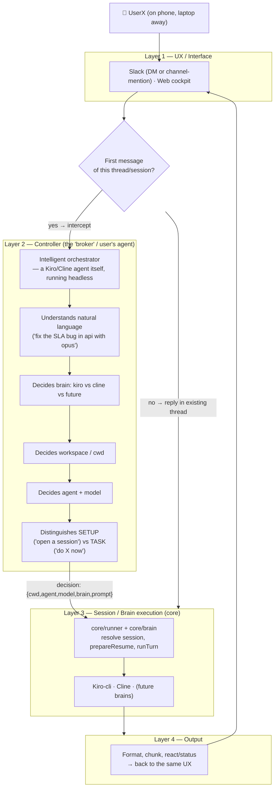

# cli-controller — Architecture (single source of truth)

> Read this first. Compact by design: tables over prose. Reflects code as of P4.
> **Status:** P0 stabilize ✅ · P1 Brain abstraction ✅ · P2 Cline brain ✅ · P3 Slack channels ✅ · P4 web cockpit ✅ · Controller memory ✅ (core/memory) · P5 onboarding ⏳ · P6 public release ⏳. Roadmap detail in [`../roadmap/`](../roadmap/); memory design in [`arch_2_sequence.md`](arch_2_sequence.md).

## 1. What it is
Local, single-user control plane with **two clearly segregated sides**:

- **Controller** — the interface/management agent (this is the **canonical name**; earlier docs also said *Orchestrator* / *manager*). It owns everything on *your* side of the conversation: understanding the request, routing (which brain / repo / agent / model), session binding, `!` admin control, and the persistent cross-session **memory**. The Controller is itself a headless brain call (today a fast `kiro-cli` call — `broker.js`); it never does your coding task.
- **CLIs / Brains** — the AI coding tools the Controller drives: **Kiro** (`kiro-cli`) and **Cline** (`cline`) today; Claude Code / Codex later. A Brain does the actual coding work in a repo and knows *nothing* about Slack, the web cockpit, memory, or routing.

Front-ends ("**Interfaces**": Slack + web) are how a human reaches the Controller. No server, no DB, runs on your own machine. **Doctrine: individual-dev UX beats extensibility whenever they conflict.**

```
                          ┌──────── the ONE integration boundary ────────┐
 Interfaces ──► Controller ──►  core/brain adapter  ──► Brains / CLIs
 Slack ─┐       (routing,          (uniform contract)      ┌─ Kiro   (kiro-cli)
 Web   ─┴─►     sessions,     ───────────────────────────► ┼─ Cline  (cline)
                memory, !admin)                            └─ (Claude Code / Codex later)
```

## 1.1 Controller ↔ CLIs — segregation & integration points

**Hard rule: the two sides meet at exactly one seam — the brain adapter (`core/brain`).** Interfaces
and the Controller NEVER spawn or parse a CLI directly; they go through an adapter. A Brain NEVER
reaches back into Slack / web / memory / routing. This single seam is what lets a CLI be added or
swapped in one file with no changes elsewhere.

| | **Controller** (your side) | **CLIs / Brains** (tool side) |
|---|---|---|
| Role | Interpret, route, own sessions + memory, `!` admin | Do the coding task in a repo |
| Knows about | Workspaces, brains, agents, models, aliases, threads, memory | Only its own cwd / session / prompt |
| Code | `slack-bridge` + `web-ui` (interfaces) · `broker.js` (routing) · `core/runner.js` · `core/memory` | `core/brain/kiro.js`, `core/brain/cline.js` (adapters) + the external CLI |
| Lifecycle | Long-running (bridge / panel processes) | Per-turn child process (spawned, then exits) |
| State | `state.json` (thread→session) + `~/.cli-controller/memory` | Native store (`~/.kiro/sessions`, `~/.cline`) |

**Integration points (the entire seam — nothing else crosses it):**
1. **`core/brain/index.js`** — registry: `getBrain(id)` / `listBrains()` / `hasBrain(id)`. Adding a CLI = one adapter file + one registry line.
2. **`adapter.runTurn(input) → {ok,output,error,sessionId?,…}`** — the ONE call that runs a turn on a CLI. All prompt/flag translation is *inside* the adapter (Kiro: prompt via **stdin**; Cline: prompt via **argv**).
3. **`adapter.capabilities`** — `{resume,agents,models,images,sessionStore,singleWriterLock,incrementalOutput,planMode}`. Every CLI difference is gated on these flags, so **interfaces contain no `if (brain==='x')`.**
4. **Session discovery / resume** — `listSessions` · `recentSessions` · `getSessionInfo` · `prepareResume` · `buildResumeCommand` · `forceUnlock`. Uniform across CLIs; per-CLI locking hides behind `prepareResume`.
5. **`core/runner.runTurn`** — the brain-agnostic executor the web cockpit uses (resume-lock check → `runTurn` → failure-safe session capture → memory record). The Slack bridge has its own equivalent path; both reach a CLI only through the adapter.
6. **`adapter.doctor()`** — is this CLI installed / usable (used by setup + `doctor`).

> If you ever find yourself special-casing a CLI *outside* its adapter, that is the bug — push the
> difference behind a capability flag instead. (Full method contract in §3.)

## 1.5 Layered processing model (how a message actually gets handled)

Every inbound message passes through 4 layers. **Only layer 2 (Controller) is conditional** — it intercepts a message *only if it's the first message of a thread* (a "direct address" to the system); everything else skips straight to layer 3.



**Why this split matters (the mental model):** the Controller is the user's **personal agent-for-hire**, not a router bolted onto Slack. Its whole job is to let UserX skip typing "computerish" commands — it holds the knowledge (workspaces, brains, agents, models, aliases) so a plain sentence from a phone becomes a fully-specified session. It only ever touches the **first** message of a thread; once a session exists, the thread *is* the session and messages go straight to Layer 3 — the Controller has nothing left to decide.

The Controller **is itself a headless brain call** (today: a fast Kiro-cli call — see `broker.js`), which is why it can "drive its intelligence by inferring from its knowledge base": it's the same kind of agent the user is trying to invoke, just given a different, fixed job (interpret + delegate, never do the coding task itself). This is also why adding a brain to the registry (`core/brain`) automatically makes it a candidate the Controller can route *to* — the broker's prompt lists `listBrains()` live.

| Layer | Owns | Current code | Conditional? |
|---|---|---|---|
| 1 UX | Human-facing transport | `slack-bridge` (Bolt), `web-ui` | always |
| 2 Controller | NL understanding → session decision (brain/cwd/agent/model), setup-vs-task | `slack-bridge/src/broker.js` (headless Kiro call) | **only on first message of a thread** |
| 3 Session/Brain | Resume-lock check, spawn the actual brain, capture session id | `core/runner.js`, `core/brain/*` | always (every message) |
| 4 Output | Format/chunk/react, deliver to origin UX | `format.js`, `chunk.js`, reactions/SSE | always |


```
core/                      # interface- & brain-agnostic (built-ins only, no deps)
  brain/index.js           # registry: getBrain(id)/listBrains()/hasBrain; auto-loads cline if present
  brain/kiro.js            # Kiro low-level (spawn kiro-cli) + Brain adapter
  brain/cline.js           # Cline adapter (spawn cline --json, JSONL parse)
  runner.js                # runTurn(): brain-agnostic one-shot turn (used by web); resume-lock + failure-safe capture + memory capture
  memory/index.js          # persistent controller memory — factory (backend-swappable; ai-memory pluggable later)
  memory/json-store.js     # default backend: zero-dep append-only JSONL + in-memory index + search; cross-process refresh
slack-bridge/              # Slack interface (@slack/bolt Socket Mode) — thin transport
  src/index.js             # events, commands, allow-list, orchestration (runTurn), broker routing
  src/kiro.js              # SHIM → re-exports core/brain/kiro low-level (compat for broker/index)
  src/broker.js            # NL router (fast Kiro haiku call) → {cwd,agent,model,brain,prompt,note}
  src/config.js            # startup validation + safety warnings (P0)
  src/parse.js             # pure command parsing (parseNew, expandHome) — unit-tested (P0)
  src/{format,chunk,sessions}.js
  bridge / run.sh          # lifecycle (bash, macOS); run.sh sets NODE_EXTRA_CA_CERTS pre-boot (corp TLS)
  doctor.js                # cross-platform diagnostics (P0): `./bridge doctor`
  test/*.test.js           # node:test — parse/chunk/config/brain/cline (24 tests)
  state.json               # thread→session pointer store (gitignored)
web-ui/
  server.js                # Express :1234 (127.0.0.1) — reads native files + core brain/runner
  public/index.html        # single-file SPA (Dashboard/Sessions/Chat/Bridge)
  panel                    # lifecycle (bash)
plans/architecture/{architecture.md,improvements.md}   plans/roadmap/{README,01..05}.md
```
Non-user secrets/runtime gitignored: `.env`, `state.json`, `macos-ca.pem`, `*.log`, `*.pid`, `node_modules`.

## 3. Brain contract (`core/brain`)
Adapter per CLI. Adding a brain = one file + one registry entry. Interfaces/web contain **no `if(brain==='x')`** — all divergence is behind capabilities/hooks.
- `id, displayName, capabilities`
- `runTurn({cwd,sessionId,agent,model,trustTools,prompt,timeoutMs,onData,onSpawn}) → {ok,output,error,code,sessionId?}`
- `listSessions(cwd)` (global; reads native store) · `recentSessions(n)` · `listAgents/listModels`
- `prepareResume(id) → {action:'ok'} | {action:'blocked',pid,reason,options}` (encapsulates per-tool locks)
- `buildResumeCommand(s)` (always includes required flags e.g. `--agent`) · `doctor()`

**Capability matrix** (verified):
| | resume | agents | models | sessionStore | singleWriterLock | incrementalOutput |
|---|---|---|---|---|---|---|
| **Kiro** | ✅ `--resume-id` | ✅ | ✅ | ✅ files `~/.kiro/sessions/cli/*.json` | ✅ `.lock`+PID | ❌ (block-buffers) |
| **Cline** | ✅ `--id` | ❌ (plan/act) | ✅ `-m/-P/-k` | ✅ `cline history --json` (`~/.cline`) | ❌ | ✅ (`--json` JSONL) |

Kiro turn: `kiro-cli chat --no-interactive [--resume-id][--agent][--model] (--trust-all-tools|--trust-tools=X)`, prompt via **stdin**, ANSI-stripped.
Cline turn: `cline -c <cwd> --json --auto-approve <ALL?t:f> [--id][-m][-P][-t] <prompt>`; parse JSONL → last `run_result.text` = output, `.taskId` = sessionId. **Live run needs `cline auth` + corp CA** (Bun binary; env gate, not adapter bug).

## 4. Interfaces
**Slack** (`slack-bridge`): thread = session. `state.json` key `"<channel>:<thread_ts>"` → `{cwd,agent,model,brain,verbose,sessionId,announced}`.
- DM: any message starts/continues (as before).
- **Channel (P3): @mention to START; thread reply to CONTINUE (no mention); allow-list still gates WHO can run.** Needs scopes `app_mentions:read,channels:history,groups:history` + bot invited (see SETUP.md). `BOT_USER_ID` from `auth.test`.
- Plain text on a **first message** → **Controller** (Layer 2, §1.5) intercepts. If the controller's memory has a strong open-session match (score ≥ `KIRO_RESUME_PROMPT_MIN_SCORE`, default 1.2), it asks **resume-vs-new** and the thread enters `CONTROLLER_PENDING` (the next reply is the answer, resolved by `resolvePending`); otherwise it routes `{cwd,agent,model,brain,prompt}` and starts. Replies inside a live session-thread skip the Controller (Layer 3 directly).
- **In a live thread, `!` addresses the *controller*, bare text addresses the *agent*** (control-routing model, arch_2_sequence §11): a bare reply continues the coding session; `!<known cmd>` is a deterministic fast action; `!<natural language>` is classified by `broker.routeAdmin` into an admin action (switch brain/model/agent, verbose, abort, end, clear, recent, status) — the controller can "snatch control" of a thread any time. Fast commands stay LLM-free (safety/latency); NL is the catch-all, falling back to `!help` on a miss. `!new [brain=][dir=|alias][agent=][model=][-q]`, quick aliases `!<name>`, `!recent/!teleport/!agents/!models/!help` are global.

**Web cockpit** (`web-ui`, :1234, localhost): now a peer interface that also RUNS turns.
| API | Purpose |
|---|---|
| `GET /api/status`,`/api/sessions?brain=&source=&agent=&q=&sort=`,`/api/sessions/:id` | status; brain-aware unified list (Kiro files + Cline history), tagged brain/source; detail + resumeCmd |
| `GET /api/brains` | brains + capabilities (UI gates fields) |
| `POST /api/resume-check {brain,sessionId}` | prepareResume (Kiro lock) |
| `POST /api/run {brain,cwd,agent,model,sessionId,prompt}` → `{runId}` | start turn via `core/runner`; async, tracked in-memory |
| `GET /api/runs/:id` / `…/events` (SSE) | poll / stream **lifecycle+elapsed** (not content — see §7) |
| `GET /api/bridge/{logs,threads}`,`POST /api/bridge/{start,stop,restart}` | bridge control (cross-platform status via `process.kill(pid,0)`) |
SPA views: Dashboard, Sessions (brain/source filter, search, sort), **Chat** (new/continue composer, capability-gated, SSE timeline, resume-lock surfaced), Bridge. Search = in-memory metadata (SQLite FTS deferred until corpus is large — no infra until needed).

## 5. Turn lifecycle (both interfaces)
`pick brain (getBrain(state.brain||default)) → prepareResume if resuming → brain.runTurn → capture new sessionId (res.sessionId || listSessions diff) → format/emit`.
- **Capture is failure-safe:** runs even on a failed fresh turn (backend hiccup still creates the session with the user's msg → retry resumes WITH context); returns a genuinely-new id or `null`, **never** an unrelated session.
- Default brain: env `KIRO_DEFAULT_BRAIN` (default `kiro`).

## 6. State & storage
- **Native tool session files = source of truth for transcripts** (Kiro `~/.kiro/sessions/cli/`, Cline `~/.cline`). Core never rewrites them.
- `state.json` = derived pointer store (thread→session + prefs incl. `brain`). Survives restarts.
- No DB. Any future SQLite index is **derived/rebuildable**, never authoritative.
- **Controller memory** (`core/memory`, implemented): the Controller's ever-persistent, cross-session index — append-only JSONL at `~/.cli-controller/memory/events.jsonl` (never deleted; `end` only marks closed), replayed into an in-memory index with token+recency search. Captured after every turn on **both** run paths (Slack `runTurn`, `core/runner`), plus a routing `decisions_log` and Slack-thread↔session linkage. Cross-process reads `refresh()` from the shared log (bridge writes, web reads). Backend is swappable — `ai-memory` (arch_2_sequence §4.6) can replace the JSONL backend behind the same method surface. Surfaced via Slack `!recall <query>` and web `GET /api/memory/{search,recent}`.

## 7. Hard constraints (physics — violating any is a bug)
1. **No live content streaming for Kiro** — non-TTY block-buffers stdout & `.jsonl` (flush at turn end). "Live" = lifecycle events + elapsed only. Cline CAN stream (`--json`, `incrementalOutput:true`) — reserved via that flag. PTY was evaluated & **rejected** (native module, breaks on Node upgrades).
2. **Global session lists read native files**, never a cwd-scoped `list`.
3. **Resume must re-supply required flags** (Kiro `--agent`); built into `buildResumeCommand`.
4. **Capture survives failure; never latches an unrelated session** (§5).
5. **Cross-platform or it doesn't ship** — Node process control (`process.kill(pid,0)`), not `kill -0`/bash-only. (Full Windows lifecycle CLI = P5.)
6. **corp TLS:** Node/Bun reject MITM CA → `run.sh` sets `NODE_EXTRA_CA_CERTS` from `macos-ca.pem` pre-boot. Bare `node src/index.js` skips it.
7. **Prompt via stdin (Kiro), args-array spawn (never shell string)** — no injection, no arg-length limits.

## 8. Security
Remote code execution on your box by design. Defaults must stay safe: `SLACK_ALLOWED_USER_IDS`=self (never `*` for shared workspaces), tool-trust opt-in (not `ALL`), web bound to `127.0.0.1`. Config check + `doctor` warn on `allow-all`+`trust-all`. Web `/api/run` executes turns locally — same surface, localhost-only.

## 9. Config / diagnostics / tests (P0)
- `src/config.js validate(env)` at startup: fatal only on missing Slack tokens; warns on allow-all/trust-all/missing dirs.
- `./bridge doctor` (`node doctor.js`): Node, kiro-cli, bridge status, panel port, warnings.
- `npm test` (slack-bridge): `node --test` — 24 unit tests (parse/chunk/config/brain/cline).
- Key env: `SLACK_BOT_TOKEN/APP_TOKEN`, `SLACK_ALLOWED_USER_IDS`, `KIRO_AGENT/MODEL/DEFAULT_CWD`, `KIRO_TRUST_TOOLS`, `KIRO_DIR_ALIASES`, `KIRO_QUICK_ALIASES`, `KIRO_BROKER[_MODEL]`, `KIRO_DEFAULT_BRAIN`, `KIRO_TIMEOUT_MS`, `KIRO_SNIPPET_THRESHOLD`, `CLINE_BIN`, `PANEL_PORT`.

## 10. Run / dev
```
bridge start|stop|restart|status|logs|doctor      # Slack bridge (alias)
panel  start|stop|restart|open                     # web cockpit :1234 (alias)
cd slack-bridge && npm test                         # unit tests
```

## 11. Next (P5–P6) + open gates
- **P5:** `cli-controller` Node binary + NL onboarding wizard (pick brain → Slack tokens via app-manifest → chat-to-continue) + `config.json`/keychain + cross-platform lifecycle (folds `run.sh` CA + wires Cline CA). Bridge/panel become subcommands.
- **P6:** package as npm **`cli-controller-lib`** (bin/engines/lean deps, `npx`), curated README + 1-min install, secure defaults, `SECURITY.md`/`CONTRIBUTING.md`/`CHANGELOG.md`, config migration. `npm publish` + repo→public need user creds.
- **External gates (not code bugs):** live Slack channel use needs the added scopes + `/invite @bot`; live Cline turn needs `cline auth` + corp CA.

> Extended rationale & any older detail: `improvements.md` (reviewed roadmap) and `../roadmap/`. This file is the current truth; update it with every architectural change.
