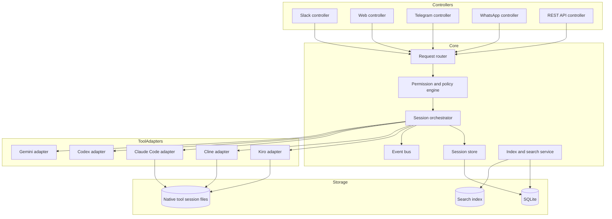

# cli-controller Product Improvements

> Work item: `architecture`  
> File: `plans/architecture/improvements.md`  
> Goal: identify what needs to improve for `cli-controller` to become a genuinely good, extensible product rather than a useful one-off local bridge.

---

## 1. Product vision

`cli-controller` should evolve from:

> A Slack bridge for controlling Kiro CLI.

into:

> A local-first control plane for developer AI agents, where multiple controllers can operate multiple CLI-based AI coding tools through a clean, extensible architecture.

In short:

```text
Today:
Slack -> Kiro CLI

Future:
Slack / Web / Telegram / WhatsApp / REST API / IDE
  -> controller layer
  -> core orchestration layer
  -> AI tool adapter layer
  -> Kiro / Cline / Claude Code / Codex / Gemini / custom CLIs
```

The product should become a **developer AI session hub**.

---

## 2. Your improvement ideas

### 2.1 Support more CLIs, not only Kiro CLI

Current limitation:

- The system is tightly built around `kiro-cli`.
- The Kiro integration assumes Kiro-specific concepts:
  - `kiro-cli chat`
  - `--resume-id`
  - `--no-interactive`
  - `--trust-tools`
  - `kiro-cli agent list`
  - `kiro-cli chat --list-sessions`
  - Kiro session files under `~/.kiro/sessions/cli`

Desired improvement:

- Add support for additional AI coding CLIs, especially:
  - Cline CLI
  - Claude Code CLI
  - Codex CLI
  - Gemini CLI
  - custom/internal AI tools

Product-level goal:

```text
The user should be able to choose the AI tool per session.
```

Example user requests:

```text
Start a Cline session in cli-controller.
Start a Kiro session in api with Opus.
Continue this old Claude Code session.
Use Codex to review this repo.
```

Architecture implication:

- Introduce a pluggable **AI Tool Adapter** interface.

Conceptual interface:

```ts
interface AiToolAdapter {
  id: string;
  displayName: string;

  startTurn(input: RunTurnInput): Promise<RunTurnResult>;

  listSessions?(query: SessionQuery): Promise<AiSession[]>;
  resumeSession?(sessionId: string, input: RunTurnInput): Promise<RunTurnResult>;
  listAgents?(): Promise<Agent[]>;
  listModels?(): Promise<Model[]>;
  validateConfig?(): Promise<ValidationResult>;
}
```

---

### 2.2 Support more controllers, not only Slack bridge

Current limitation:

- The primary controller is Slack.
- The web UI mostly observes and controls the Slack bridge.
- There is no clean abstraction for Telegram, WhatsApp, Discord, REST API, IDE extensions, local TUI, etc.

Desired improvement:

- Treat Slack as one controller among many.

Possible future controllers:

| Controller | Purpose |
|---|---|
| Slack | Remote control from phone/workspace. |
| Web | Full developer dashboard and session control. |
| Telegram | Lightweight mobile chat control. |
| WhatsApp | Mobile control where WhatsApp is preferred. |
| Discord | Community/team-style control. |
| REST API | Programmatic automation and integration. |
| Local terminal TUI | Keyboard-first local control. |
| IDE extension | VS Code/Cursor/Kiro IDE-style integration. |

Architecture implication:

- Introduce a pluggable **Controller Adapter** interface.

Conceptual interface:

```ts
interface ControllerAdapter {
  id: string;
  displayName: string;

  start(): Promise<void>;
  stop(): Promise<void>;

  onUserMessage(handler: ControllerMessageHandler): void;
  sendMessage(target: ControllerTarget, message: ControllerResponse): Promise<void>;
  sendStatus?(target: ControllerTarget, status: RunStatus): Promise<void>;
}
```

---

### 2.3 Make the web UI sticky-helpful for developers

Current limitation:

- The UI is useful for viewing sessions and bridge status.
- But it is not yet a strong daily developer workspace.
- It does not yet let the developer fully search, understand, start, continue, and manage sessions from the browser.

Desired improvements:

#### Natural-language session search

The developer should be able to ask:

```text
show me sessions where I fixed auth issues
find the session where we discussed Slack Socket Mode
which sessions touched api last week?
show failed or aborted runs
show sessions with high context usage
```

This requires:

- Indexing session metadata.
- Optional indexing of transcript/session content.
- Full-text search at minimum.
- Semantic search later.
- Filters by:
  - repo
  - tool
  - controller/source
  - agent
  - model
  - date
  - message count
  - context usage
  - status

#### Start sessions from web

The web UI should allow:

```text
New session
  Tool: Kiro / Cline / Claude Code / Codex
  Repo: select from known workspaces
  Agent: select
  Model: select
  Prompt: textarea
```

#### Continue sessions from web

The session detail page should allow:

```text
Continue this session:
[ prompt box ]
[ run ]
```

The result should stream or appear in the browser, and optionally mirror to Slack/Telegram if the session is linked.

#### Better session detail

The session detail page should show:

- Full transcript.
- Tool calls.
- Files touched.
- Commands run.
- Errors.
- Timeline.
- Cost/tokens/context if available.
- Resume command.
- Linked controller threads.
- Notes/tags.

#### Developer-friendly persistence

The UI should remember:

- Last selected repo.
- Last selected tool.
- Favorite sessions.
- Pinned workspaces.
- Filters.
- Recently used prompts.
- Saved prompt templates.

---

### 2.4 Decouple the architecture

Current limitation:

- The architecture is coupled:
  - Slack message logic knows too much about Kiro.
  - Web UI knows about Kiro session files and bridge state.
  - `kiro.js` is not an interchangeable adapter.
  - State model is built around Slack thread -> Kiro session.
  - Lifecycle control is script/process-specific.

Desired improvement:

Separate the system into clear layers:

```text
Controllers
  -> Core orchestration
  -> Tool adapters
  -> Local AI CLIs
```

Target shape:

```text
controllers/
  slack/
  web/
  telegram/
  whatsapp/
  rest-api/

core/
  sessions/
  routing/
  orchestration/
  permissions/
  events/
  config/
  logging/

tools/
  kiro/
  cline/
  claude-code/
  codex/

storage/
  sqlite/
  files/
  search-index/
```

The core should not care whether a request came from Slack, web, Telegram, or an API.

A controller should not care whether a run is performed by Kiro, Cline, Claude Code, Codex, or another tool.

---

## 3. Additional improvement ideas

### 3.1 Introduce a real core domain model

Right now, important concepts are implicit in files, Slack handlers, and Kiro-specific helpers.

Define first-class domain objects:

```text
User
Controller
Workspace
AiTool
Session
Turn
Run
Message
Artifact
ToolCall
Event
```

Example:

```text
Session
  id
  title
  workspaceId
  toolId
  controllerLinks[]
  currentStatus
  createdAt
  updatedAt

Turn
  id
  sessionId
  prompt
  response
  status
  startedAt
  completedAt
  toolCalls[]
  artifacts[]
```

Why this matters:

- Enables multi-tool support.
- Enables multi-controller support.
- Makes web search easier.
- Makes session handoff possible.
- Makes persistence cleaner.
- Makes analytics possible.

---

### 3.2 Add a central session database

Current state is split across:

- `slack-bridge/state.json`
- Kiro session files
- log files
- pid files
- in-memory maps

For product quality, add a small local database.

Recommended option:

```text
SQLite
```

Why SQLite:

- Local-first.
- No service dependency.
- Easy backups.
- Good enough for thousands of sessions.
- Supports indexing and search extensions.
- Works cross-platform.

Possible tables:

```text
sessions
turns
messages
controller_links
tool_runs
workspaces
ai_tools
events
artifacts
settings
```

The system can still read native Kiro session files, but should maintain its own normalized product state.

---

### 3.3 Add search as a central product feature

Search should be a first-class capability, not an afterthought.

Levels:

#### Level 1 — Metadata search

Search by:

- title
- cwd
- repo name
- agent
- model
- source/controller
- date
- status

#### Level 2 — Transcript search

Search inside prompts/responses.

#### Level 3 — Semantic search

Search by meaning:

```text
that session where we debugged auth middleware
```

Possible implementation:

- SQLite FTS5 for text search.
- Optional embeddings for semantic search.
- Background indexer for tool transcripts.
- Incremental indexing after each turn.

---

### 3.4 Make web a first-class controller

The web UI should not be only an observer.

It should become:

```text
A full AI coding session cockpit.
```

Features:

- Start session.
- Continue session.
- Stop/abort run.
- Switch model/agent/tool.
- Attach to existing Slack session.
- Detach from Slack.
- View live output.
- View run history.
- Add notes/tags.
- Compare sessions.
- Export transcript.
- Open workspace in editor.
- Open changed files.

---

### 3.5 Add real-time updates

Current UI polls APIs, and Slack receives final responses.

A product-grade system should support real-time updates.

Options:

- Server-Sent Events.
- WebSocket.
- Event bus in core.
- Log/event streaming from tool adapters.

Desired UX:

```text
Prompt submitted
  -> run started
  -> tool call started
  -> command output
  -> file edited
  -> response streaming
  -> run completed
```

This would make the web UI feel alive and make long-running tasks easier to trust.

---

### 3.6 Improve process and run management

Current model:

- One child process per turn.
- In-memory `running` map.
- PID files for bridge/panel.
- Bash lifecycle scripts.

Needed improvements:

- Cross-platform process manager.
- Persistent run records.
- Run status survives controller restart.
- Kill process tree reliably on Windows/macOS/Linux.
- Better timeout handling.
- Queue or concurrency limits.
- Per-workspace locking.
- Run retry strategy.
- Zombie process detection.
- Structured run logs.

---

### 3.7 Add permission and safety model

Current safety is mostly:

- Slack allow-list.
- Kiro trust tools setting.

Product-grade safety should answer:

```text
Who can run what, where, using which tools, with what permissions?
```

Suggested model:

| Concept | Example |
|---|---|
| User | Slack user, web user, API token owner |
| Workspace permission | Can access repo A, not repo B |
| Tool permission | Can use Kiro, cannot use shell-enabled tool |
| Action permission | Can read files, edit files, run commands |
| Approval policy | Auto-approve reads, ask before writes/commands |
| Environment | personal laptop, work laptop, sandbox |

Possible policy example:

```yaml
users:
  U123:
    workspaces: [cli-controller, api]
    tools: [kiro, cline]
    maxTrust: fs_read
```

---

### 3.8 Add authentication for the web UI

Currently, the web UI is localhost-only and unauthenticated.

That is acceptable for a local utility, but not for a product.

Options:

- Local password.
- Magic local token.
- OS keychain-backed token.
- GitHub OAuth.
- Slack login.
- Tailscale identity if remote.

At minimum:

- Keep bound to `127.0.0.1`.
- Warn if bound externally.
- Require auth if exposed beyond localhost.

---

### 3.9 Add workspace registry

Today workspaces come from:

- `KIRO_DEFAULT_CWD`
- `KIRO_DIR_ALIASES`
- ad hoc paths

A product should have a workspace registry:

```yaml
workspaces:
  cli-controller:
    path: C:\Users\you\Desktop\work\cli-controller
    defaultTool: kiro
    defaultAgent: main
    defaultModel: claude-sonnet-5
    tags: [personal, node, controller]

  api:
    path: C:\Users\you\Documents\project-b\api
    defaultTool: cline
    defaultAgent: main
    tags: [work, java]
```

Benefits:

- Easier UI selection.
- Safer routing.
- Better search filters.
- Cleaner natural-language routing.
- Per-workspace permissions.

---

### 3.10 Add session handoff across controllers

A strong product feature would be:

```text
Start in Slack -> continue in Web -> monitor from phone -> resume in terminal.
```

This requires controller links:

```text
sessionId
  linked to Slack thread
  linked to web conversation
  linked to terminal resume command
```

The product should treat Slack thread IDs, Telegram chat IDs, browser session IDs, etc. as links to the same core session.

---

### 3.11 Add event-driven architecture

Instead of direct calls everywhere, the core should emit events:

```text
session.created
turn.started
tool.output
tool.error
turn.completed
session.linked
session.archived
```

Controllers subscribe and render events in their own way.

Example:

```text
Core emits: turn.completed

Slack controller:
  posts response in thread

Web controller:
  updates run timeline

REST controller:
  exposes completed status

Logger:
  writes structured log
```

This decouples the product heavily.

---

### 3.12 Add observability

Needed for real usage:

- Structured logs.
- Request IDs / run IDs.
- Per-turn duration.
- Tool exit code.
- Error category.
- Last successful run.
- Session count.
- Active run count.
- Failed run count.
- Token/context stats if available.

Dashboard should show:

```text
Health
Active runs
Recent failures
Slow sessions
High-context sessions
Tool availability
Config warnings
```

---

### 3.13 Add onboarding/setup wizard

Current setup requires manual `.env` editing and Slack app setup knowledge.

Product-grade onboarding:

- Detect installed AI CLIs.
- Verify Slack tokens.
- Verify Socket Mode.
- Verify workspace paths.
- Verify Kiro/Cline auth status.
- Create sample workspace.
- Run smoke test.
- Show warnings:
  - allow-all
  - trust-all
  - missing paths
  - unreachable CLI
  - invalid tokens

Could be available in:

```text
web-ui /setup
```

or:

```bash
cli-controller doctor
```

---

### 3.14 Add `doctor` command

A product-quality local tool needs diagnostics.

Example:

```bash
cli-controller doctor
```

Checks:

- Node version.
- npm install status.
- Slack env variables present.
- Slack auth works.
- Kiro CLI installed.
- Cline CLI installed.
- Config paths exist.
- Dashboard port available.
- Bridge process status.
- File permissions.
- Session store readable.
- Security warnings.

Example output:

```text
✓ Node v22
✓ Slack bot token present
✓ Kiro CLI found
✗ Cline CLI not found
⚠ SLACK_ALLOWED_USER_IDS=*
⚠ KIRO_TRUST_TOOLS=ALL
✗ api path does not exist
```

---

### 3.15 Add plugin system later

If the long-term goal is multiple tools and multiple controllers, define plugin contracts early.

Plugin types:

```text
Tool plugin
Controller plugin
Storage plugin
Search plugin
Auth plugin
Renderer plugin
```

Possible folder:

```text
plugins/
  tools/
    kiro/
    cline/
  controllers/
    slack/
    telegram/
    web/
```

Important: avoid over-engineering at first. Start with internal adapters, then external plugins later.

---

### 3.16 Improve Slack UX

Slack can become much better:

- Home tab showing sessions.
- Slash commands:
  - `/ai new`
  - `/ai recent`
  - `/ai continue`
- Interactive buttons:
  - Abort
  - Continue
  - Open in Web
  - Change model
- Modals for new session setup.
- Better session cards.
- Link from Slack session to web dashboard.
- Thread title updates.
- Per-run progress updates.

---

### 3.17 Improve web UX

Potential improvements:

- Command palette.
- Natural-language search bar.
- Session timeline.
- Run timeline.
- Transcript viewer.
- Prompt composer.
- Workspace switcher.
- Tool switcher.
- Model/agent picker.
- Tags/favorites.
- Continue-here button.
- Send-this-session-to-Slack button.
- Open-in-editor button.
- Files-touched panel.
- Commands-run panel.
- Errors panel.
- High-context warning.
- Session compaction/summarization.

---

### 3.18 Add REST API

A REST API would make the product scriptable and help decouple the web UI from local files.

Possible endpoints:

```text
POST /api/sessions
POST /api/sessions/:id/turns
POST /api/runs/:id/abort
GET  /api/sessions
GET  /api/sessions/:id
GET  /api/runs/:id
GET  /api/workspaces
GET  /api/tools
GET  /api/controllers
```

---

### 3.19 Add background indexer

A background service should index:

- Kiro session files.
- Cline sessions.
- Tool transcripts.
- Run logs.
- Workspace metadata.
- Git info.

This powers:

- Search.
- Analytics.
- Session detail.
- Recommendations.
- Routing.

---

### 3.20 Add artifacts and file-change tracking

For coding agents, the most useful question is often:

```text
What changed?
```

Track:

- Files read.
- Files edited.
- Commands run.
- Tests run.
- Test failures.
- Git diff before/after.
- Generated files.
- Logs attached.

Session detail should show these as artifacts.

---

## 4. Proposed decoupled architecture



---

## 5. Suggested staged roadmap

### Stage 0 — Stabilize current product

Goal: make today's Slack + Kiro + web setup reliable.

Work:

1. Cross-platform process status/control.
2. Config validation.
3. Startup doctor.
4. Safer defaults/warnings.
5. Better logs.
6. Basic tests for parsing and state logic.

---

### Stage 1 — Extract core

Goal: separate Slack from Kiro logic.

Work:

1. Create `core/`.
2. Move session model into core.
3. Move run orchestration into core.
4. Keep Kiro as first tool adapter.
5. Keep Slack as first controller adapter.
6. Make web talk to core API instead of reading files directly.

---

### Stage 2 — Make web a real controller

Goal: web can start and continue sessions.

Work:

1. New session form.
2. Continue session composer.
3. Live run status.
4. Abort from web.
5. Transcript viewer.
6. Session search.

---

### Stage 3 — Add second AI tool

Goal: prove adapter architecture.

Recommended first second tool:

```text
Cline CLI
```

Work:

1. Understand Cline CLI capabilities.
2. Implement Cline adapter.
3. Normalize sessions/runs into shared model.
4. Allow tool choice in Slack and web.
5. Compare behavior with Kiro adapter.

---

### Stage 4 — Add second controller

Goal: prove controller architecture.

Options:

- REST API
- Telegram
- Discord
- WhatsApp

Recommended first second controller:

```text
REST API or Telegram
```

Reason:

- REST API proves core decoupling.
- Telegram proves another chat controller without Slack assumptions.

---

### Stage 5 — Search and knowledge layer

Goal: make session history genuinely useful.

Work:

1. SQLite session index.
2. Transcript indexing.
3. Natural-language search.
4. Tags/favorites.
5. Artifacts/files/commands tracking.

---

### Stage 6 — Product polish

Goal: make it feel like a real product.

Work:

1. Setup wizard.
2. Doctor command.
3. Secure defaults.
4. Better dashboard UX.
5. Install/update story.
6. Documentation.
7. Tests.
8. Release packaging.

---

## 6. What “real good product” means here

A real good product should be:

| Quality | Meaning |
|---|---|
| Extensible | Adding Cline or Telegram should not require rewriting the bridge. |
| Safe | Users should not accidentally expose full machine control. |
| Searchable | Old sessions should become useful knowledge, not forgotten logs. |
| Cross-platform | Windows/macOS/Linux should behave predictably. |
| Observable | Failures should be visible and diagnosable. |
| Controller-neutral | Slack, web, Telegram, API should all be peers. |
| Tool-neutral | Kiro, Cline, Claude Code, Codex should all be adapters. |
| Developer-native | Should understand repos, branches, files, commands, tests, sessions. |
| Local-first | Should work locally without cloud infrastructure. |
| Progressive | Starts simple, but architecture supports growth. |

---

## 7. Sharp product thesis

The strongest version of `cli-controller` is not:

> Slack bridge for Kiro.

It is:

> A local-first control plane for AI coding agents, with pluggable tools, pluggable controllers, searchable session memory, and a developer-grade web cockpit.

That is the product direction worth designing toward.

---

## 8. Reviewer addendum — grounded critique (added on review)

> This section reviews §1–§7 against the codebase's actual constraints (see `architecture.md` §23). The vision is sound and worth pursuing. The items below are the corrections, contradictions, and gaps that must be resolved before this roadmap is trustworthy.

### 8.1 Blocking correction: "live streaming" is not currently possible

Multiple headline features assume live, mid-run output:
- §2.3 "The result should stream or appear in the browser"
- §3.4 "View live output"
- §3.5 "Add real-time updates … response streaming"
- §3.17 "Run timeline"

**These collide with a hard constraint** (`architecture.md` §23 #1/#2): `kiro-cli` is spawned with piped (non-TTY) stdio and **block-buffers stdout until turn end**. There is no mid-run token stream today, and a PTY (`node-pty`) — the only way to get one — was **deliberately rejected** for stability (native module, breaks on Node upgrades). So:

- Server-Sent Events / WebSocket plumbing (§3.5) is worth building, **but the only events it can carry today are lifecycle events** (`run.started`, `run.completed`, `run.failed`) and elapsed-time heartbeats — **not** streaming content.
- Real content streaming requires one of: (a) revisiting the PTY decision (accepting the stability cost), (b) each tool CLI exposing a native streaming/JSON-event mode (Kiro currently does not over piped stdio), or (c) tailing the tool's own transcript file *if* it flushes incrementally (Kiro's `.jsonl` also updates only at turn end — verified).

**Action:** every "live output" feature in this doc must be re-scoped to "lifecycle events + elapsed time" until a tool adapter proves incremental output. Do not promise streaming in the UI/roadmap without that proof.

### 8.2 Contradiction: WhatsApp as a peer controller

§2.2 and the §4 diagram list **WhatsApp** as a controller. This directly contradicts the project's founding decision (`evaluation.md`, `free-safe-recommendation.md`): Slack was chosen **specifically to avoid the account-ban risk of unofficial WhatsApp libraries**. Listing WhatsApp as a casual peer re-introduces the exact risk the project rejected.

**Correction:** WhatsApp is only viable via the **official WhatsApp Cloud API** (business number, Meta app review, template-message rules) — a heavy, non-local dependency — never the unofficial web-reverse-engineered route. Either drop WhatsApp from the near/mid-term controller list or annotate it "official Cloud API only; not the banned unofficial path." Telegram (official Bot API, free, no ban risk) is the correct lightweight-mobile second controller, and the roadmap already picks it — good.

### 8.3 Under-estimated: cross-CLI normalization

§2.1's adapter interface is the right shape, but the doc assumes other CLIs map cleanly onto Kiro's model (resumable `sessionId`, `--agent`, `--trust-tools`, on-disk session store, cwd-scoped listing, lock files). In reality these differ per tool:
- Not every CLI has resumable sessions, an "agent" concept, or a discoverable session store.
- "Trust/permissions" flags are tool-specific and not 1:1.
- Transcript location/format differs (some have none).

**Action:** the shared domain model (§3.1) must be the **lowest common denominator**, and the interface's optional methods (`listSessions?`, `resumeSession?`, `listAgents?`) must be genuinely optional in every consumer — the web/search features that assume a uniform session store need a graceful "this tool doesn't support resume/agents/history" fallback. Also carry Kiro's hard invariants into the adapter contract explicitly: resume must re-supply the agent (§23 #4), and global session listing must not rely on a cwd-scoped `list` (§23 #3).

### 8.4 Missing: store-ownership rule for the SQLite/native-files split

§3.2 says "The system can still read native Kiro session files, but should maintain its own normalized product state" — without stating who owns what. This is exactly the divergence that already bites today (`--list-sessions` vs the `.json` files don't fully agree).

**Rule to adopt:** native tool session files are the **source of truth for conversation content**; SQLite is a **derived, rebuildable index** for metadata/search/links — never authoritative for transcript content, and must be reconstructable by re-scanning native files. State the rebuild path (`doctor --reindex`). This prevents silent drift.

### 8.5 Missing productization items worth adding

| Gap | Why it matters |
|---|---|
| **Migration story `state.json` → SQLite** | Existing thread→session pointers must survive the store change. Version the schema (`architecture.md` P2 flagged this) and ship a one-time importer. |
| **Packaging / install / update** | Mentioned once (Stage 6) with no substance. Decide: `npx cli-controller`, versioned releases, config migration on upgrade, launchd/systemd/Windows-service install. This is the difference between "my script" and "a product." |
| **Secrets at rest** | Slack tokens live in plaintext `.env`. §3.8 mentions keychain only for *web auth*. For a product, tool/controller credentials should move to the OS keychain, `.env` being the dev-only fallback. |
| **Broker cost/latency** | Every plain message spawns a haiku routing call — a per-message tax in latency and tokens. At product scale, cache the routing decision per thread and make the broker opt-in per user/controller. |
| **Global concurrency cap** | §3.6 mentions per-workspace locking; also needed: a machine-wide cap. Parallel agent runs each consume real memory/CPU and hit the same tool backend — unbounded parallelism will thrash the box. |
| **Test depth** | "Basic tests" (Stage 0) is too thin for the refactor ahead. A core extraction without tests for parsing/routing/format/**session-capture** will regress. Elevate: unit (command parsing, aliases, capture-on-failure, format), mocked-CLI integration, API tests against fixture session files. |
| **Session-capture correctness (already a live bug class)** | Stage 0 must explicitly include the capture-on-failure + no-unrelated-fallback invariant (`architecture.md` §23 #7) and transient-backend-failure handling (§23 #9). These are not hypothetical — they caused a "zoned-out thread" incident. |

### 8.6 Scope decision the roadmap dodges: single-user vs multi-user

The permission model (§3.7, with per-user workspace/tool grants) quietly assumes **multi-user**. But the current product is **single-user, single-machine** (it remote-controls *your* box). Multi-user means either a shared machine or multi-machine orchestration — a large scope jump with real auth/isolation burden. **Pick one explicitly.** For a personal tool, §3.7 collapses to "one owner; the only real knobs are which repos/tools/trust the owner allows a given *controller* to use" — much smaller. Don't build a multi-tenant permission engine for a single-user tool.

### 8.7 ROI reordering (what to actually do first)

The staged roadmap is directionally right, but for a solo/personal tool the highest-value, lowest-cost work should not wait behind speculative multi-controller/multi-tool infrastructure. Recommended near-term order:

1. **Stage 0 as written** (cross-platform lifecycle, config validation, `doctor`, safer defaults, logs) — **plus** the session-capture/transient-failure hardening (§8.5) and a first test suite. This is pure health, no speculation.
2. **Search over existing native files** (SQLite FTS5 index of the `.json`/`.jsonl` you already have). Immediate daily value, no adapter/controller work required, and it forces the derived-index ownership rule (§8.4) early.
3. **Extract core + make web talk to a core API** (Stage 1) — but only far enough that the web can **continue** an existing session (the single biggest UX win) before chasing "start any tool from web."
4. **Defer** multi-controller (Telegram/REST), the plugin system (§3.15), the event-driven core (§3.11), and the second AI tool until there is a concrete need. They are correct eventually; they are not what makes the tool better next month. The doc says "avoid over-engineering" once (§3.15) — apply that judgment across §3.7/§3.11/§3.15/§3.18.

### 8.8 Bottom line

Not bogus — this is a genuinely good north star, and the adapter/core/search direction is the right one. Its two real flaws are **(1) it promises live streaming that the current no-PTY design cannot deliver**, and **(2) it re-lists WhatsApp against the project's own ban-risk rationale**. Fix those two, adopt the store-ownership rule, add the missing productization items (migration, packaging, secrets-at-rest, tests, capture-correctness), decide single- vs multi-user, and sequence by ROI rather than by architectural completeness. Then it's a plan worth executing.
