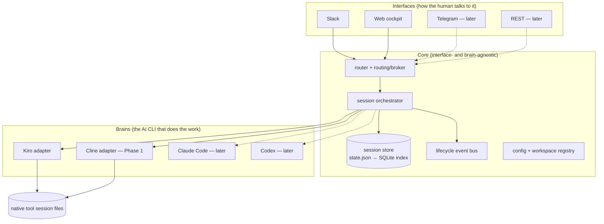

# cli-controller — Master Improvement Plan

> Location: `plans/roadmap/`
> Status: draft
> Author: rupeshcash (with Claude)
> Scope: turn the current Slack→Kiro bridge into an extensible, public, one-minute-install **local-first control plane for developer AI agents** — without ever sacrificing the single-developer experience.

---

## 1. Vision

**Today:** `Slack thread → kiro-cli` on your own machine.

**Target:** a local tool where a developer picks a **Brain** (the AI CLI/agent that does the work — Kiro now, Cline next, Claude Code / Codex later) and drives it through an **Interface** (Slack now; web, Telegram, REST later), with a **web cockpit** to see, search, start, and continue every session — set up in one minute by talking to it in natural language.

```
Interfaces            Core                    Brains
──────────            ────                    ──────
Slack  (now)   ─┐                      ┌─ Kiro     (now)
Web    (now)   ─┤──►  orchestration ──►├─ Cline    (Phase 1)
Telegram (later)┤     + sessions       ├─ Claude Code (later)
REST   (later) ─┘     + store/search   └─ Codex    (later)
```

## 2. The one guiding doctrine (read this first)

> **When a decision trades individual-developer UX against extensibility, individual-developer UX wins. Every time.**

This tool exists to make one developer's life easier. Nothing beats "make a Slack thread and ask." Extensibility is pursued **only** to the depth that lets us add Cline cleanly and not wall ourselves off from future interfaces — it is **never** a reason to add ceremony, latency, config, or steps that a solo dev would feel.

Corollaries (the tie-breakers):
- **No infra.** Local-first, zero external services, no DB server, no build step for the UI. (SQLite file is allowed as a derived index.)
- **Refactor, don't rebuild.** Abstractions are extracted from working code, proven by adding *one* second implementation (Cline), then stopped. No speculative plugin marketplace.
- **Fewer steps > more options.** Natural-language onboarding and routing beat flag-soup. Every added knob must earn its place.
- **Windows and macOS both work.** No feature ships that only works on one.
- **Honor the hard constraints.** See §5 — these are physics, not preferences.
- **Anti-scope (we will NOT build now):** multi-tenant permission engine, hosted/cloud mode, plugin SDK for third parties, WhatsApp via the unofficial (ban-risk) path, live token streaming that requires a PTY. See [`01`](01-brain-multi-cli.md)/[`02`](02-interfaces.md) for why.

Full doctrine with worked decision examples is embedded in each workstream doc.

## 3. Target architecture at a glance

Three layers + a core. The core owns the domain model; it does not know Slack, and it does not know Kiro.



Two contracts do all the extensibility work:
- **Brain adapter** — "run a turn / resume / list sessions / capabilities" for one AI CLI. Details: [`01-brain-multi-cli.md`](01-brain-multi-cli.md).
- **Interface (Controller) adapter** — "receive a user message / send a reply / send status" for one front-end. Details: [`02-interfaces.md`](02-interfaces.md).

## 4. Documents in this plan

| Doc | Covers | Delivers |
|---|---|---|
| [`01-brain-multi-cli.md`](01-brain-multi-cli.md) | Core extraction + **Brain adapter** contract + Kiro adapter (extract current code) + **Cline Phase 1 (fully functional)** + per-tool quirk handling (Kiro resume-lock/PID) + capability matrix + store ownership | Two working brains behind one interface. |
| [`02-interfaces.md`](02-interfaces.md) | **Interface/Controller adapter** contract (refactor-only, no new interface built) + Slack made a clean controller + **Slack channel support** + web-as-controller | Slack + web are peers; adding Telegram later is a new file, not a rewrite. |
| [`03-web-ui.md`](03-web-ui.md) | Session **tracking** improvements + **web CLI chat** (start & continue sessions in the browser) + tool-quirk UX (Kiro lock) + lifecycle events (no fake streaming) | The web cockpit becomes a real daily driver. |
| [`04-onboarding.md`](04-onboarding.md) | **Natural-language `cli-controller` setup wizard**: pick a Brain (kiro-cli / cline-cli / API key), pick a bridge (Slack + token steps), then continue onboarding *by chatting with the bot or in the CLI*. Cross-platform. `doctor`. | Zero-to-running in one minute, by talking to it. |
| [`05-public-release.md`](05-public-release.md) | Make the repo public, **curated README + one-minute install**, packaging/distribution, secure defaults, docs | Anyone can install and use it. |

## 5. Non-negotiable constraints (physics)

These come from `../architecture/architecture.md` §23 and bound every design here. Any plan item that violates one is wrong.

1. **No live token streaming without a PTY** — Kiro (and its `.jsonl`) block-buffer when not a TTY; PTY was rejected for stability. So "live output" everywhere in this plan means **lifecycle events + elapsed time**, not streaming content — unless a specific Brain proves incremental output.
2. **Global session lists read native files** — never a cwd-scoped `list` command.
3. **Resume must re-supply the agent/context flags** the Brain needs — carried into the Brain contract.
4. **Session capture must survive a failed turn and never latch onto an unrelated session.**
5. **Native tool session files are the source of truth for transcripts; any DB/index is derived and rebuildable.**
6. **Cross-platform or it doesn't ship.**

## 6. Phased roadmap (ROI-ordered)

Each phase is independently shippable and leaves the tool better than before. Personal-UX wins gate each phase.

| Phase | Theme | Headline outcome | Depends on |
|---|---|---|---|
| **P0** | Stabilize + cross-platform | Windows/macOS lifecycle, `doctor`, config validation, session-capture correctness, first tests | — |
| **P1** | Extract core + Brain adapter | Kiro runs through a `Brain` interface; nothing user-visible changes | P0 |
| **P2** | **Cline as a first-class Brain** | "start a Cline session in X" works end-to-end from Slack + web | P1 |
| **P3** | Interface adapter + **Slack channels** | Slack works in channels (not just DM); Slack/web are peer controllers | P1 (parallel with P2) |
| **P4** | **Web cockpit: track + chat** | Search sessions; start & continue any session from the browser | P1, P2 |
| **P5** | **NL onboarding wizard** | `cli-controller` → talk-to-set-up (Brain → bridge → chat-to-continue), cross-platform | P1, P3 |
| **P6** | **Public release** | Public repo, curated README, one-minute install, packaging | all above |

Detailed phase breakdowns (tasks, acceptance criteria, dependencies) live at the end of each workstream doc under a **"Phasing"** heading.

## 7. Definition of done (product-level)

The plan is realized when a developer who has never seen the repo can:

1. Install in **≤ 1 minute** on Windows or macOS (`05`).
2. Run `cli-controller`, and **in plain language** pick a Brain and a bridge, with the tool guiding them (`04`).
3. **Continue onboarding by chatting with their Slack bot** — or entirely in the CLI (`04`).
4. Drive **Kiro or Cline** from **Slack (DM or channel) or the web cockpit**, choosing the tool per session (`01`,`02`,`03`).
5. **See, search, start, and continue** every session (terminal, Slack, web) in one web cockpit, with per-tool quirks (e.g. Kiro resume-lock) handled for them (`03`).
6. Never hit a step that exists only to serve extensibility rather than their own workflow (§2).

## 8. What this plan deliberately does NOT do

- Build a second interface right now (only refactor so it's a file, not a rewrite — `02`).
- Introduce hosted/multi-user/cloud modes (single owner, single machine).
- Ship a third-party plugin SDK, an event-sourced core, or a permission engine.
- Promise streaming content in the UI (physics — §5.1).
- Add WhatsApp via the unofficial, account-ban-risk route (the founding decision of this project rejected it).
