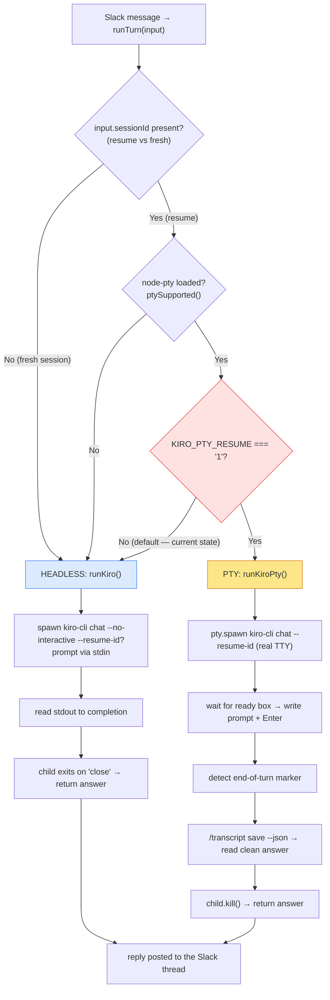

# PTY vs Headless — How cli-controller Runs Kiro

> **Context**: Document exactly when the bridge drives Kiro headlessly vs through an interactive PTY, to settle the "do we use PTY now?" question.
> **Author**: rupeshcash (via kiro)
> **Created**: 2026-07-15
> **Last updated**: 2026-07-15
> **Status**: complete

## TL;DR

- Two run modes exist: **headless** (`kiro-cli chat --no-interactive`, prompt on stdin) and **interactive PTY** (`kiro-cli chat` in a real pseudo-terminal via `node-pty`).
- The PTY path is a **POC, resume-only**. It runs only when a turn has a `sessionId` **and** `node-pty` is loaded **and** `KIRO_PTY_RESUME=1`.
- `KIRO_PTY_RESUME` is **not set** in the current bridge, so **every turn today is headless**, teleport included.
- PTY is **not teleport-specific**. Teleport is the motivating case (rehydrating a TUI/subagent session headless resume can't reconstruct, Kiro#9066), but the gate fires on *any* resume when the flag is on.
- Both modes are **per-turn**: the child process exits (headless) or is killed (PTY) when the turn finishes. Neither holds a live process between turns, so Slack sessions never accumulate in RAM.

## Decision logic (verified — `core/brain/kiro.js:185`)

```js
runTurn(input):
  if (input.sessionId && kiroPty.ptySupported() && process.env.KIRO_PTY_RESUME === '1')
      return runKiroPty(input);   // interactive PTY (resume only)
  return runKiro(input);          // headless --no-interactive (default)
```

- `input.sessionId` present → this is a **resume** turn (a fresh turn has no sessionId).
- `ptySupported()` → `node-pty` loaded (it is an `optionalDependency`; absent on some installs).
- `KIRO_PTY_RESUME === '1'` → explicit opt-in env flag.

All three must hold. Miss any one and the turn runs headless.

## Flow



## Why the PTY path exists

Headless `kiro-cli chat --no-interactive --resume-id <id>` cannot fully rehydrate sessions that were created in the interactive TUI (subagent state, TUI-only context). This is Kiro#9066. When you `!teleport` a TUI-origin session into a Slack thread and continue it, headless resume would answer without that context. The PTY path drives the real interactive TUI, lets it rehydrate, sends the prompt, then captures a clean answer via Kiro's own `/transcript save --json` export instead of scraping the terminal stream.

It stays behind an opt-in flag because a full TUI turn is heavier than headless (spawns the `acp` + `chat` + `bun tui.js` process group, roughly 25–50 MB) and, when a turn never emits the end-of-turn marker, cleanup falls back to a hard timeout (default 20 min) before the child is killed.

## RAM implications

- **Headless (today):** one transient `kiro-cli` process per in-flight turn, freed on turn completion. Idle threads hold zero processes.
- **PTY (if enabled):** same per-turn lifecycle (`finish()` calls `child.kill()`), but a heavier process group per active turn and a longer worst-case lingering window if the end-of-turn marker is missed.
- The many long-lived `kiro-cli chat --agent main` + `acp` + `tui.js` process groups visible in `ps` are **interactive terminal/TUI sessions** left open by hand. They are not bridge children (the PTY path always passes `--resume-id`; those groups had none).

## References

- `core/brain/kiro.js` — `runTurn` adapter (decision), `runKiro` (headless)
- `core/brain/kiro-pty.js` — `runKiroPty` (PTY), `ptySupported`, transcript capture
- Kiro headless-resume limitation: kirodotdev/Kiro#9066
