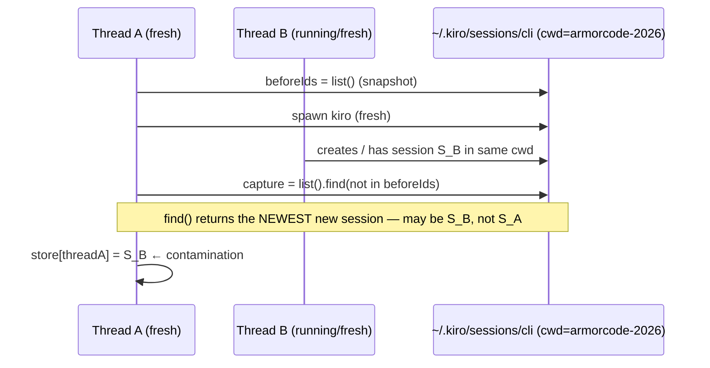

# RCA — Cross-Session Contamination in the Slack Bridge

> **Context**: Two distinct Slack threads answered from each other's Kiro session. Reported before a production/npm release.
> **Author**: rupeshcash (via kiro)
> **Created**: 2026-07-15
> **Last updated**: 2026-07-15
> **Status**: in-progress

## TL;DR

- **Root cause (directly observed):** a fresh Kiro turn discovers its own session id by diffing `kiro-cli --list-sessions` before/after the spawn (`captureNewSession`). It takes the *first new session in the cwd* and assumes it is ours. When another session is created in the same cwd during that window (a second Slack thread, or a terminal `kiro-cli` in the same dir), it captures the **wrong** session, latching two Slack threads onto one Kiro session.
- **Why the fresh path always runs the risky code:** headless `runKiro` returns `{ok, output, error, code}` with **no sessionId**, so `res.sessionId || captureNewSession(...)` always falls through to the diff. `kiro-cli` has no create-with-id flag, so we cannot avoid the diff — we can only make it strict.
- **Evidence:** `state.json` has multiple distinct thread keys mapped to the *same* sessionId (`dc1b2030…` ×4, `c5010dff…` ×2, `3a63c1c3…` in two different cwds), plus one garbage entry `sessionId: "the"`.
- **The user's incident:** Thread A ("Debug octo", 16:30) and Thread B ("lambda extraction", 15:57) both ran in `armorcode-2026` with overlapping timing. Same cwd + overlap = the collision condition.
- **Debunked hypothesis:** starting with a snippet/attachment is **not** the cause. It only adds download latency, widening the race window a little.
- **The error screenshot is a separate issue:** a transient Kiro backend `InternalServerError` (request_id `ddc455d8…`); the trailing "Tool approval required but --no-interactive was specified" is Kiro's post-error fallback, not a cli-controller bug. Retryable.

## What happened (observed)

`slack-bridge/src/index.js`:

```js
async function captureNewSession(brain, cwd, beforeIds) {
  const now = await brain.listSessions(cwd);
  const fresh = now.find((s) => !beforeIds.has(s.sessionId));   // ← first/newest new session
  return (fresh && fresh.sessionId) || null;
}
```

Fresh-turn path in `runTurn`:

```js
const beforeIds = isFresh ? new Set((await brain.listSessions(st.cwd)).map(s => s.sessionId)) : new Set();
let res = await brain.runTurn({ ... });          // headless runKiro → NO res.sessionId
...
const sid = res.sessionId || await captureNewSession(brain, st.cwd, beforeIds);  // always the fallback
if (sid) store.set(threadKey, { sessionId: sid });
```

`core/brain/kiro.js` `runKiro` resolves `{ ok, output, error, code }` — no `sessionId`. So every fresh turn attributes its session by the before/after diff.

## Mechanism (the race)

`captureNewSession` is correct only when **exactly one** new session appears in the cwd between snapshot and capture. It breaks when a second session is created in that same cwd during the window:



Once `store[threadA] = S_B`, every future reply in Thread A resumes S_B, so Thread A speaks with Thread B's context and output. `find()` returning the first match (newest-first list) makes grabbing the *other* thread's session likely under overlap.

Contributing conditions in the incident:
- Both threads used the same cwd `armorcode-2026`.
- Overlapping timing (long lambda task still active).
- No serialization of fresh-session creation per cwd.
- No validation of the captured id (hence the `"the"` entry).

## Separate issue — the error screenshot

`InternalServerError: Encountered an unexpected error … request_id ddc455d8…` at `crates/chat-cli/src/cli/chat/mod.rs:2042` is a **Kiro backend** transient. The stderr banner confirms trust-all was on ("All tools are now trusted (!)"), and the trailing "Tool approval required but --no-interactive was specified" is Kiro's fallback after the backend error disrupted the turn. cli-controller surfaced it correctly (`ok=false`). Action: retry. Optional nicety: detect this error class and append a "transient Kiro error, resend to retry" hint.

## Fix

`kiro-cli` cannot be told a session id at creation (verified via `kiro-cli chat --help`: only `--resume-id`, `--resume`, `--resume-picker`, `--list-sessions`, `--delete-session`). So the diff stays, but is made **strict** and **contamination-proof**:

### Applied — strict capture (contamination becomes impossible)
`captureNewSession` now:
- Computes the full set difference, not `find()`.
- Returns the id only when **exactly one** new session appeared.
- If **zero** → returns null (turn created none).
- If **more than one** → refuses to guess, returns null, logs a warning. Better to start fresh next reply than to hijack a stranger's session.
- Validates the id against a UUID pattern (kills the `"the"` bug).

With strict capture, the bridge can never latch a thread onto another thread's session. Worst case under concurrency is a missed capture (next reply starts fresh, losing that turn's context) — a lesser, non-corrupting failure.

### Proposed follow-up — per-cwd creation serialization (full correctness)
To make "exactly one new session" the *normal* outcome even when two fresh threads start in the same cwd at once, serialize only the **creation window** per cwd (snapshot → spawn → first-detection), releasing before awaiting full turn output so long turns don't block parallel work. This needs a small restructure of the spawn/capture path and is proposed separately because it touches the hottest code path and has a parallelism trade-off to confirm.

### State cleanup
`state.json` already contains contaminated mappings (shared sessionIds) and one `"the"`. These persist across restarts. Recommend: null out the `"the"` entry, and optionally reset sessionId for thread keys that share an id, so affected threads start clean.

## Verification

- `node --test` green after the capture change (see `slack-bridge/test`).
- The fix activates on the next `./bridge restart`. `state.json` persists thread→session mappings, so healthy threads keep context.

## References

- `slack-bridge/src/index.js` — `captureNewSession`, `runTurn`
- `core/brain/kiro.js` — `runKiro` (no sessionId), `buildArgs`
- `slack-bridge/state.json` — duplicate-sessionId evidence
- `kiro-cli chat --help` — no create-with-id flag
